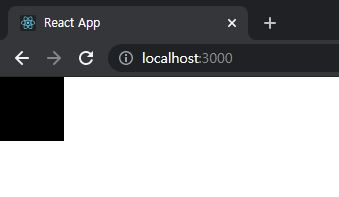
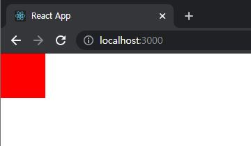

# ReactJS-15 Context API

- Context API는 전역적으로 사용할 데이터가 있을 때 유용한 기능
  - ex) 로그인 정보, 애플리케이션 환경 설정, 테마 등


## 1. Context API를 사용한 전역 상태 관리 흐름

- 프로젝트 내에서 환경 설정, 사용자 정보와 같은 **전역적으로 필요한 상태를 관리**해야 할 때 어떻게 할 것인가
- 컴포넌트 간에 데이터를 props로 전달하기 때문에 컴포넌트 여기저기서 필요한 데이터가 있을 때는 주로 **최상위 컴포넌트인 App**의 `state`에 넣어서 관리한다.

- 다양한 컴포넌트들이 트리 형태로 많은 높이가 쌓였을 때, 컴포넌트 간의 데이터를 전달할 시 매우 비효율적이다.
- 이를 위해, 리덕스나 MobX 같은 상태 관리 라이브러리를 사용하여 전역 상태 관리 작업을 더욱 편하게 처리한다.


## 2. Context API 사용법 익히기

```bash
$ yarn create react-app context-tutorial
```


### 2-1) 새 Context 만들기

```react
// src/contexts/color.js
import { createContext } from 'react';

const ColorContext = createContext({ color: 'black' });

export default ColorContext;
```

- 새로운 Context를 만들 때는 createContext 함수를 사용
  - 파라미터에는 해당 Context의 기본 상태를 저장한다.


### 2-2) Consumer 사용하기

```react
// src/components/ColorBox.js
import React from 'react';
import ColorContext from '../contexts/color';

const ColorBox = () => {
    return (
        <ColorContext.Consumer>
            {value => (
                <div 
                    style={{
                        width: '64px',
                        height: '64px',
                        background: value.color
                    }}

                />

            )}
        </ColorContext.Consumer>
    );
};

export default ColorBox;
```

- ColorBox 라는 컴포넌트를 만들어서 ColorContext 안에 들어 있는 색상을 보여준다. 
- 이때 색상을 `props`로 받아오는 것이 아니라 ColorContext안에 들어 있는 `Consumer` 라는 컴포넌트를 통해 색상을 조회한다.
- `Consumer` 사이에 중괄호를 열어서 그 안에 **함수**를 넣어 준다. 이러한 패턴은 **Function as a child**, 혹은 Render Props 라고 한다.
  - <u>컴포넌트의 children이 있어야 할 자리</u>에 일반 JSX 혹은 문자열이 아닌 **함수**를 전달한다.


```react
// src/App.js
import React from 'react';
import ColorBox from './components/ColorBox';

const App = () => {
  return (
    <div>
      <ColorBox />
    </div>
  );
};

export default App;
```




### 2-3) Provider

- `Provider`를 사용하면 **Context의 value를 변경**할 수 있다.

```react
// src/App.js
import React from 'react';
import ColorBox from './components/ColorBox';
import ColorContext from './contexts/color';

const App = () => {
  return (
    <ColorContext.Provider value={{ color: 'red' }}>
      <div>
        <ColorBox />
      </div>
    </ColorContext.Provider>
  );
};

export default App;
```



- 기존에 `createContext` 함수를 사용할 때는 파라미터로 **Context의 기본값**을 넣어 주었다.

  - 이 기본값은 `Provider`를 <u>사용하지 않았을 때만 사용</u>된다.

  - 만약 `Provider`는 사용했는데 value를 명시하지 않았다면, 이 기본값을 사용하지 않기 때문에 오류가 발생

  - ```react
    // 다음과 같은 경우는 오류가 발생한다.
    // src/App.js
    ...
    
    const App = () => {
      return (
        <ColorContext.Provider>
        ...
        </ColorContext.Provider>
      );
    };
    
    export default App;
    ```

  - Provider 를 사용할 때는 value 값을 명시해 주어야 한다!


