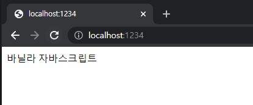
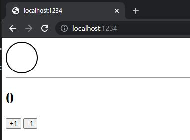
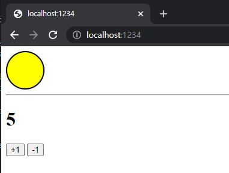

# ReactJS-16 리덕스 라이브러리

- 리덕스는 가장 많이 사용하는 **리액트 상태 관리 라이브러리**이다.


## 1.  개념 정리

### 1-1) 액션

- <u>상태에 어떠한 변화가 필요</u>하면 **액션(action)** 이란 것이 발생
- 액션 객체는 **type 필드**를 반드시 가지고 있어야 한다.

```javascript
{
    type: 'ADD_TODO',
    data: {
        id: 1,
        text: '리덕스 배우기'
    }
},
{
    type: 'CHANGE_INPUT',
    text: '안녕하세요'
}
```


### 1-2) 액션 생성 함수

- 액션 객체를 만들어 주는 함수

```javascript
function addTodo(data) {
    return {
        type: 'ADD_TODO',
        data
    };
}

// 화살표 함수로도 가능
const changeInput = text => ({
    type: 'CHANGE_INPUT',
    text
});
```


### 1-3) 리듀서(reducer)

- **변화를 일으키는 함수**
- 액션을 만들어서 발생시키면 리듀서가 현재 상태와 전달 받은 액션객체를 파라미터로 받아 온다.
- 그리고 두 값을 참고하여 **새로운 상태를 만들어서 반환**해 준다.

```javascript
const initialState = {
    counter: 1
};
function reducer(state = initialState, action) {
    switch (action.type) {
        case INCREMENT:
        	return {
                counter: state.counter + 1
            };
        default:
            return state;
    }
}
```


### 1-4) 스토어(store)

- 프로젝트에 **리덕스를 적용하기 위해 스토어**를 만든다.
- 한 개의 프로젝트는 단 하나의 스토어만 가질 수 있다.
- 스토어 안에는 현재 애플리케이션 상태와 리듀서가 들어가 있으며, 그 외에도 몇가지 중요한 내장함수를 지닌다.


### 1-5) 디스패치(dispatch)

- 스토어의 내장 함수 중 하나이다.
- '액션을 발생시키는 것'이라고 이해
- `dispatch(action)` 과 같은 형태로 액션 객체를 파라미터로 넣어서 호출
- 이 함수가 호출되면 스토어는 <u>리듀서 함수를 실행시켜서 새로운 상태</u>를 만들어 준다.


### 1-6) 구독(subscribe)

- 스토어의 내장 함수 중 하나이다.
- subscribe 함수 안에 리스너 함수를 파라미터로 넣어서 호출하면, 이 리스너 함수가 액션이 디스패치 되어 **상태가 업데이트 될때마다 호출**된다.

```javascript
const listener = () => {
    console.log('상태가 업데이트됨');
}
const unsubscribe = store.subscribe(listener);

unsubscribe();
```


## 2. 리액트 없이 쓰는 리덕스

- 리덕스는 리액트에 종속되는 라이브러리가 아니다.
- 리덕스는 바닐라 자바스크립트와 함께 사용할 수 있다.
- 바닐라 자바스크립트는 라이브러리나 프레임워크 없이 사용하는 순수 자바스크립트 그 자체를 의미


### 2-1) Parcel로 프로젝트 만들기

```bash
$ yarn global add parcel-bundler
# yarn global 설치가 안된다면 npm install -g parcel-bundler
```

```bash
$ mkdir banilla-redux
$ cd vanilla-redux
# package.json 파일 생성
$ yarn init -y
```

- 디렉터리 열어서 index.html, index.js 파일 생성

```html
// index.html
<html>
    <body>
        <div>바닐라 자바스크립트</div>
        <script src="./index.js"></script>
    </body>
</html>
```

```javascript
// index.js
console.log('hello parcel');
```

- 개발용 서버 실행
  - localhost:1234

```bash
$ parcel index.html
```



- 리덕스 모듈 설치

  - ```bash
    $ yarn add redux
    ```


### 2-2) 간단한 UI 구성

```css
// index.css
.toggle {
  border: 2px solid black;
  width: 64px;
  height: 64px;
  border-radius: 32px;
  box-sizing: border-box;
}

.toggle.active {
  background: yellow;
}
```

```html
<html>
    <head>
        <link rel="stylesheet" type="text/css" href="index.css" />
    </head>
    <body>
        <div class="toggle"></div>
        <hr />
        <h1>0</h1>
        <button id="increase">+1</button>
        <button id="decrease">-1</button>
        <script src="./index.js"></script>
    </body>
</html>
```




### 2-3) DOM 레퍼런스 만들기

- UI를 관리할 때 별도의 라이브러리를 사용하지 않기 때문에 DOM을 직접 수정해 주어야 한다.

```javascript
// index.js
const divToggle = document.querySelector('.toggle');
const counter = document.querySelector('h1');
const btnIncrease = document.querySelector('#increase');
const btnDecrease = document.querySelector('#decrease');
```


### 2-4) 액션 타입과 액션 생성 함수 정의

- 프로젝트의 상태에 변화를 일으키는 것을 액션

```javascript
// index.js
...

// 액션에 이름을 정의
const TOGGLE_SWITCH = 'TOGGLE_SWITCH';
const INCREASE = 'INCREASE';
const DECREASE = 'DECREASE';
```

- 액션 객체를 만드는 액션 생성 함수를 작성
- 액션 객체는 type값을 반드시 가지고 있어야 한다.

```javascript
// index.js
...

const toggleSwitch = () => ({ type: TOGGLE_SWITCH });
const increase = difference => ({ type: INCREASE, difference });
const decrease = () => ({ type: DECREASE });
```


### 2-5) 초깃값 설정

- 초깃값을 정의, 초깃값의 형태는 자유

```javascript
// index.js
...

const initialState = {
    toggle: false,
    counter: 0
}
```


### 2-6) 리듀서 함수 정의

- 리듀서는 변화를 일으키는 함수
- 파라미터로는 state와 action 값을 받아온다.

```javascript
// index.js
...

// state가 undefined일 때는 initialState를 기본값으로 사용
function reducer(state = initialState, action) {
    // action.type 에 따라 다른 작업을 처리함
    switch (action.type) {
        case TOGGLE_SWITCH:
            return {
                ...state, // 불변성 유지를 해 주어야 한다.
                toggle: !state.toggle
            };
        case INCREASE:
            return {
                ...state,
                counter: state.counter + action.difference
            };
        case DECREASE:
            return {
                ...state,
                counter: state.counter - 1
            };
        default:
            return state;
    }
}
```

- 리듀서 함수가 맨 처음 호출될 때는 state 값이 undefined 이다. 
- 해당 값이 undefined 로 주어졌을 때는 initialState 를 기본값으로 설정하기 위해 함수의 파라미터 쪽에 기본값이 설정되어 있다.


### 2-7) 스토어 만들기

- `createStore` 함수 사용
- 함수의 파라미터에는 리듀서 함수를 넣어준다.

```javascript
// index.js
...

import { createStore  } from "redux";

...
const store = createStore(reducer)
```


### 2-8) render 함수 만들기

- render 함수는 **상태가 업데이트될 때마다 호출**되며, 리액트의 render 함수와는 다르게 이미 html을 사용하여 만들어진 <u>UI의 속성을 상태에 따라 변경해 준다.</u>

```javascript
// index.js
...

const render = () => {
    const state = store.getState(); // 현재 상태를 불러온다.
    // 토글 처리
    if (state.toggle) {
        divToggle.classList.add('active');
    } else {
        divToggle.classList.remove('active');
    }
    // 카운터 처리
    counter.innerText = state.counter;
};

render();
```


### 2-9) 구독하기

- 스토어의 상태가 바뀔 때마다 render 함수가 호출되도록 해줘야한다.
- 스토어의 내장 함수 subscribe를 사용하여 수행한다.
- subscribe 함수의 파라미터로는 함수 형태의 값을 전달해 주고, 추후 액션이 발생하여 상태가 업데이트될 때마다 호출된다.

```javascript
// 예시코드
const listener = () => {
	console.log('상태가 업데이트됨');
}
const unsubscribe = store.subscribe(listener);

unsubscribe();	// 추후 구독을 비활성화할 때 함수를 호출
```

- 추후 리액트 프로젝트에서 리덕스를 사용할 때는 이 함수를 직접 사용하지 않는다.
- 컴포넌트에서 리덕스 상태를 조회하는 과정에서 react-redux 라는 라이브러리가 이 작업을 대신해 준다.

```javascript
// index.js
...
render();
store.subscribe(render);
```


### 2-10) 액션 발생시키기

- 액션을 발생시키는 것을 디스패치
- 스토어의 내장 함수 dispatch 를 사용하고, 파라미터는 액션 객체를 넣어준다.

```javascript
// index.js
...

divToggle.onclick = () => {
    store.dispatch(toggleSwitch());
};
btnIncrease.onclick = () => {
    store.dispatch(increase(1));
};
btnDecrease.onclick = () => {
    store.dispatch(decrease());
};
```




## 3. 리덕스의 세 가지 규칙

### 3-1) 단일 스토어

- 하나의 애플리케이션 안에는 하나의 스토어가 들어있다.


### 3-2) 읽기 전용 상태

- 리덕스 상태는 읽기 전용이다.
- 상태를 업데이트할 때 기존의 객체는 건드리지 않고 새로운 객체를 생성해 주어야 한다.
- 리덕스에서 불변성을 유지해야 하는 이유는 내부적으로 데이터가 변경되는 것을 감지하기 위해 얕은 비교 검사를 하기 때문이다.


### 3-3) 리듀서는 순수한 함수

- 변화를 일으키는 리듀서 함수는 순수한 함수여야 한다.
  - 리듀서 함수는 이전 상태와 액션 객체를 파라미터로 받는다.
  - 파라미터 외의 값에는 의존하면 안된다.
