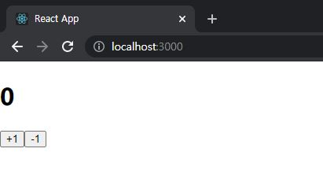
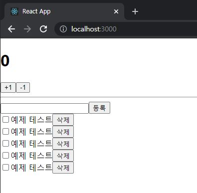
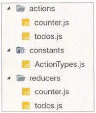
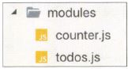
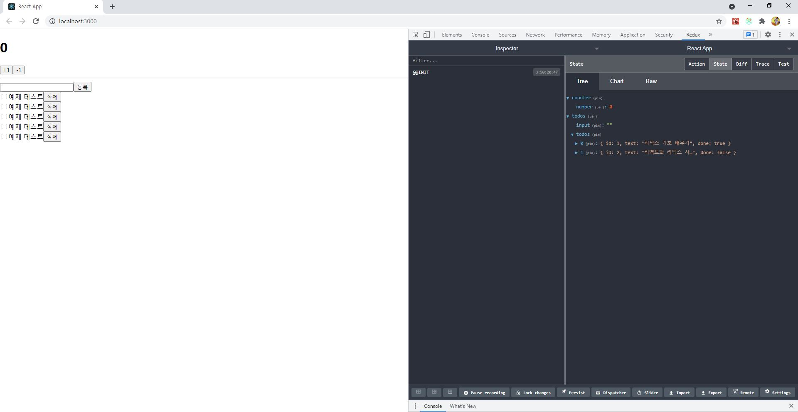
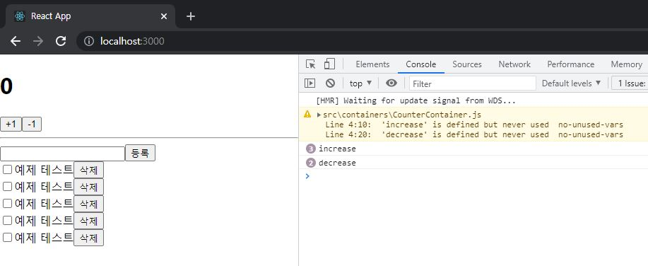
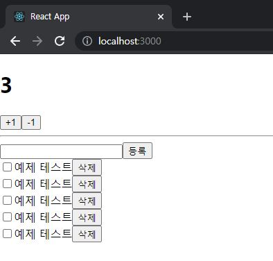
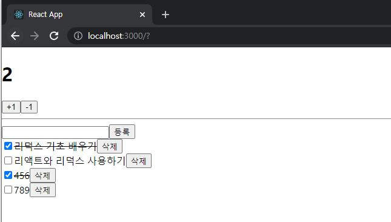

# ReactJS-17 리덕스 활용

- 리액트 애플리케이션에서 리덕스를 사용할 때는 store 인스턴스를 직접 사용하기보다는 주로 react-redux 라는 라이브러리에서 제공하는 유틸 함수(connect) 와 컴포넌트(Provider) 를 사용한다. 


## 🔥1. 작업 환경 설정

```bash
$ yarn create react-app react-redux-tutorial
$ cd react-redux-tutorial
$ yarn add redux react-redux
```


## 🔥2. UI 준비하기

- 리덕스를 사용할 때 가장 많이 사용하는 패턴: 프레젠테이셔널 컴포넌트와 컨테이너 컴포넌트를 분리
  - 프레젠테이셔널 컴포넌트: 주로 상태관리가 이루어지지 않고, 그저 props를 받아 와서 화면에 UI를 보여주기만 하는 컴포넌트
  - 컨테이너 컴포넌트: 리덕스와 연동되어 있는 컴포넌트, 리덕스로부터 상태를 받아오기도 하고 리덕스 스토어에 액션을 디스패치하기도 한다.
- 이번 프로젝트에서는 이 패턴을 사용
  - UI 관련된 프레젠테이셔널 컴포넌트: src/components
  - 리덕스와 연동된 컨테이너 컴포넌트: src/containers


### 2-1) 카운터 컴포넌트

- 숫자를 더하고 뺄 수 있는 카운터 컴포넌트

```react
// src/components/Counter.js
import React from 'react';

const Counter = ({ number, onIncrease, onDecrease }) => {
    return (
        <div>
            <h1>{number}</h1>
            <div>
                <button onClick={onIncrease}>+1</button>
                <button onClick={onDecrease}>-1</button>
            </div>
        </div>
    );
};

export default Counter;
```

```react
// src/App.js
import React from 'react';
import Counter from './components/Counter';

const App = () => {
  return (
    <div>
      <Counter number={0} />
    </div>
  );
};

export default App;
```




### 2-2) 할 일 목록 컴포넌트 만들기

- 해야 할 일을 추가하고, 체크하고, 삭제할 수 있는 할 일 목록 컴포넌트

```react
// src/components/Todos.js
import React from 'react';

const TodoItem = ({ todo, onToggle, onRemove }) => {
    return  (
        <div>
            <input type="checkbox" />
            <span>예제 테스트</span>
            <button>삭제</button>
        </div>
    );
};

const Todos = ({
    input,
    todos,
    onChangeInput,
    onInsert,
    onToggle,
    onRemove,
}) => {
    const onSubmit = e => {
        e.preventDefualt();
    };
    return (
        <div>
            <form onSubmit={onSubmit}>
                <input />
                <button type="submit">등록</button>
            </form>
            <TodoItem />
            <TodoItem />
            <TodoItem />
            <TodoItem />
            <TodoItem />
        </div>
    );
};

export default Todos;
```

```react
// src/App.js
...
import Todos from './components/Todos';

const App = () => {
  return (
    <div>
      <Counter number={0} />
      <hr />
      <Todos />
    </div>
  );
};

export default App;
```




## 🔥3. 리덕스 관련 코드 작성

- 리덕스를 사용할 때는 `액션 타입`, `액션 생성 함수`, `리듀서` 코드를 작성해야 한다.
- 이 코드들을 각각 다른 파일에 작성하는 방법이 있고, 기능별로 묶어서 파일 하나에 작성하는 방법이 있다.
  1. 
     - actions, constants, reducers 라는 세 개의 디렉토리를 만들고 그 안에 기능별로 파일을 하나씩 만드는 방식
     - 코드를 종류에 따라 다른 파일에 작성하고 정리할 수 있어서 편리하다.
     - 새로운 액션을 만들 때마다 세 종류의 파일을 모두 수정해야 하기 때문에 불편하다.
  2. 
     - **Ducks 패턴**
     - 액션 타입, 액션 생성 함수, 리듀서 함수를 기능별로 파일 하나에 몰아서 다 작성하는 방식


### 3-1) counter 모듈 작성

- Ducks 패턴을 사용하여 `액션 타입`, `액션 생성 함수`, `리듀서`를 작성한 코드를 '**모듈**' 이라고 한다.


#### 3-1-1) 액션 타입 정의

- 가장 먼저 해야 할 작업은 액션 타입을 정의하는 것
- 액션 타입은 대문자로 작성
- 문자열 내용은 '모듈 이름/액션 이름' 과 같은 형태로 작성
- 문자열 안에 모듈 이름을 넣음으로써, 나중에 프로젝트가 커졌을 때 액션의 이름이 충돌되지 않는다.

```react
// src/modules/counter.js
const INCREASE = 'counter/INCREASE';
const DECREASE = 'counter/DECREASE';
```


#### 3-1-2) 액션 생성 함수 만들기

```react
// src/modules/counter.js
...

export const increase = () => ({ type: INCREASE });
export const decrease = () => ({ type: DECREASE });
```

- 여기서 `export` 라는 키워드 사용
- 추후 이 함수를 다른 파일에서 불러와 사용할 수 있다.


#### 3-1-3) 초기 상태 및 리듀서 함수 만들기

```react
// src/modules/counter.js
...

const initialState = {
    number: 0
};

function counter(state = initialState, action) {
    switch (action.type) {
        case INCREASE:
            return {
                number: state.number + 1
            };
        case DECREASE:
            return {
                number: state.number - 1
            };
        default:
            return state;
    }
}

export default counter;
```

- 모듈의 초기 상태에는 number 값을 설정해준다.

- 리듀서 함수에는 현재 상태를 참조하여 새로운 객체를 생성해서 반환하는 코드를 작성해준다.

- `export default` 키워드를 사용하여 함수를 내보내 준다.

  - `export`는 여러 개를 내보낼 수 있고, `export default`는 단 한 개만 내보낼 수 있다.

  - ```react
    // 불러오는 방식도 다르다.
    import counter from './counter'
    import { increase, decrease } from './counter';
    // 한꺼번에 불러오고 싶을 때
    import counter, { increase, decrease } from './counter';
    ```


### 3-2) todos 모듈 만들기


#### 3-2-1) 액션 타입 정의

```react
// src/modules/todos.js
const CHANGE_INPUT = 'todos/CHANGE_INPUT';  // 인풋 값을 변경함
const INSERT = 'todos/INSERT';  // 새로운 todo를 등록함
const TOGGLE = 'todos/TOGGLE';  // todo를 체크/체크 해제함
const REMOVE = 'todos/REMOVE';  // todo를 제거함
```


#### 3-2-2) 액션 생성 함수 만들기

```react
// src/modules/todos.js
...

export const changeInput = input => ({
    type: CHANGE_INPUT,
    input
});

let id = 3; // insert가 호출될 때마다 1씩 더해진다.
export const insert = text => ({
    type: INSERT,
    todo: {
        id: id++,
        text,
        done: false
    }
});

export const toggle = id => ({
    type: TOGGLE,
    id
});

export const remove = id => ({
    type: REMOVE,
    id
});
```

- 여기서 id 값이 3인 이유는 초기 상태를 작성할 때 todo 객체 두 개를 사전에 미리 넣어둘 것이기 때문이다.


#### 3-2-3) 초기 상태 및 리듀서 함수 만들기

```react
// src/modules/todos.js
...

const initialState = {
    input: '',
    todos: [
        {
            id: 1,
            text: '리덕스 기초 배우기',
            done: true
        },
        {
            id: 2,
            text: '리액트와 리덕스 사용하기',
            done: false
        }
    ]
};

function todos(state = initialState, action) {
    switch (action.type) {
        case CHANGE_INPUT:
            return {
                ...state,
                input: action.input
            };
        case INSERT:
            return {
                ...state,
                todos: state.todos.concat(action.todo)
            };
        case TOGGLE:
            return {
                ...state,
                todos: state.todos.map(todo =>
                    todo.id === action.id ? { ...todo, done: !todo.done } : todo      
                )
            };
        case REMOVE:
            return {
                ...state,
                todos: state.todos.filter(todo => todo.id !== action.id)
            };
        default:
            return state;
    }
}

export default todos;
```


### 3-3) 루트 리듀서 만들기

- 이번 프로젝트에서는 리듀서를 여러개 만들었지만, 나중에 `createStore` 함수를 사용하여 **스토어를 만들 때는 리듀서를 하나만 사용해야 한다.**
- 기존에 만들었던 리듀서를 하나로 합쳐주어야 하는데, 리덕스에서 제공하는 `combineReducers` 라는 유틸 함수를 사용한다.

```react
// src/modules/index.js
import { combineReducers } from 'redux';
import counter from './counter';
import todos from './todos';

const rootReducer = combineReducers({
    counter,
    todos,
});

export default rootReducer;
```

- 파일 이름을 index.js 로 설정해 주면 나중에 불러올 때 디렉토리 이름까지만 입력하여 불러올 수 있다.

- ```react
  import rootReducer from './modules';
  ```


## 🔥4. 리액트 애플리케이션에 리덕스 적용

- 스토어를 만들고 리액트 애플리케이션에 리덕스를 적용하는 작업은 src 디렉토리의 index.js 에서 이루어진다.


### 4-1) 스토어 만들기

```react
// src/index.js
...
import { createStore } from 'redux';
import rootReducer from './modules';

const store = createStore(rootReducer);

...
```


### 4-2) Provider 컴포넌트를 사용하여 프로젝트에 리덕스 적용

- 리액트 컴포넌트에서 스토어를 사용할 수 있도록 **App 컴포넌트**를 react-redux에서 제공하는 **Provider 컴포넌트**로 감싸준다.
- 이 컴포넌트를 사용할 때는 store를 **props로 전달해 주어야 한다**.

```react
// src/index.js
...
import { createStore } from 'redux';
import rootReducer from './modules';
import { Provider } from 'react-redux';

const store = createStore(rootReducer);

ReactDOM.render(
  <Provider store={store}>
    <App />
  </Provider>,
  document.getElementById('root')
);
```


### 4-3) Redux DevTools 의 설치 및 적용

- [Redux DevTools](https://chrome.google.com/webstore/detail/redux-devtools/lmhkpmbekcpmknklioeibfkpmmfibljd?hl=ko&) 라는 리덕스 개발자 도구 설치(크롬 확장 프로그램)

- 코드의 가독성을 위해 패키지 설치

  - ```bash
    $ yarn add redux-devtools-extension
    ```

```react
// src/index.js
...
import { composeWithDevTools } from 'redux-devtools-extension';

const store = createStore(rootReducer, composeWithDevTools());

...
```




## 🔥5. 컨테이너 컴포넌트 만들기

- 컴포넌트에서 리덕스 스토어에 접근하여 원하는 상태를 받아 오고, 액션도 디스패치할 예정이다.
- 리덕스 스토어와 연동된 컴포넌트를 컨테이너 컴포넌트라고 부른다.


### 5-1) CounterContainer 만들기

```react
// src/containers/CounterContainer.js
import React from 'react';
import Counter from '../components/Counter';

const CounterContainer = () => {
    return <Counter />;
};

export default CounterContainer;
```

- 위 컴포넌트를 리덕스와 연동하려면 react-redux에서 제공하는 `connect` 함수를 사용해야 한다.


- `connect(mapStateToProps, mapDispatchToProps) (연동할 컴포넌트)`

  - `mapStateToProps` 는 리덕스 **스토어 안의 상태를 컴포넌트의 props로 넘겨주기 위해** 설정하는 함수

  - `mapDispatchToProps`는 **액션 생성 함수를 컴포넌트의 props로 넘겨주기 위해** 사용하는 함수

  - 이렇게 `connect` 함수를 호출하고 나면 **또 다른 함수를 반환**

  - 반환된 함수에 <u>컴포넌트를 파라미터로 넣어주면 리덕스와 연동된 컴포넌트가 된다.</u>

  - ```react
    const makeContainer = connect(mapStateToProps, mapDispatchToProps)
    makeContainer(타겟 컴포넌트)
    ```

```react
// src/containers/CounterContainer.js
import React from 'react';
import Counter from '../components/Counter';
import { connect } from 'react-redux';

const CounterContainer = ({ number, increase, decrease }) => {
    return <Counter number={number} onIncrease={increase} onDecrease={decrease} />;
};

const mapStateToProps = state => ({
    number: state.counter.number,
});
const mapDispatchToProps = dispatch => ({
    // 임시 함수
    increase: () => {
        console.log('increase');
    },
    decrease: () => {
        console.log('decrease');
    },
});

export default connect(
    mapStateToProps,
    mapDispatchToProps,
)(CounterContainer);
```

```react
// src/App.js
import React from 'react';
import Todos from './components/Todos';
import CounterContainer from './containers/CounterContainer';

const App = () => {
  return (
    <div>
      <CounterContainer />
      <hr />
      <Todos />
    </div>
  );
};

export default App;
```



---

- console.log 대신에 액션 생성 함수를 불러와서 액션 객체를 만들고 디스패치 해준다.

```react
// src/containers/CounterContainer.js
...
import { increase, decrease } from '../modules/counter';

const CounterContainer = ({ number2, up, decrease }) => {
    return <Counter number={number2} plus={up} onDecrease={decrease} />;
};

const mapStateToProps = state => ({
    number2: state.counter.number,
});
const mapDispatchToProps = dispatch => ({
    up: () => {
        dispatch(increase());
    },
    decrease: () => {
        dispatch(decrease());
    },
});

export default connect(
    mapStateToProps,
    mapDispatchToProps,
)(CounterContainer);
```



---

- `connect` 함수를 사용할 때는 일반적으로 위 코드와 같이 `mapStateToProps` 와 `mapDispatchToProps` 를 미리 선언해 놓고 사용한다.
- `connect` 함수 내부에 익명 함수 형태로 선언해도 괜찮다.

```react
// src/containers/CounterContainer.js
import React from 'react';
import Counter from '../components/Counter';
import { connect } from 'react-redux';
import { increase, decrease } from '../modules/counter';

const CounterContainer = ({ number, increase, decrease }) => {
    return (
        <Counter number={number} onIncrease={increase} onDecrease={decrease} />)
    ;
};

export default connect(
    state => ({
        number: state.counter.number,
    }),
    dispatch => ({
        increase: () => dispatch(increase()),
        decrease: () => dispatch(decrease()),
    }),
)(CounterContainer);
```

---

- 컴포넌트에서 액션을 디스패치하기 위해 각 액션 생성 함수를 호출하고 `dispatch`로 감싸는 작업이 번거로울 수 있다.
- 특히 액션 생성 함수의 개수가 많아진다면 더욱 그렇다.
- 이런 경우에 리덕스에서 제공하는 `bindActionCreators` 함수를 사용하면 간편해진다.

```react
// src/containers/CounterContainer.js
...
import { bindActionCreators } from 'redux';

...

export default connect(
    state => ({
        number: state.counter.number,
    }),
    dispatch => 
        bindActionCreators(
            {
                increase,
                decrease,
            },
            dispatch,
        ),
)(CounterContainer);
```

---

- 더 편한 방법으로는 `mapDispatchToProps` 에 해당하는 파라미터를 함수 형태가 아닌 **액션 생성 함수로 이루어진 객체 형태**로 넣어 주는 것이다.
- 두번째 파라미터를 아예 객체 형태로 넣어 주면 `connect` 함수가 내부적으로 `bindActionCreators` 작업을 대신해준다.

```react
// src/containers/CounterContainer.js
import React from 'react';
import Counter from '../components/Counter';
import { connect } from 'react-redux';
import { increase, decrease } from '../modules/counter';

const CounterContainer = ({ number, increase, decrease }) => {
    return (
        <Counter number={number} onIncrease={increase} onDecrease={decrease} />)
    ;
};

export default connect(
    state => ({
        number: state.counter.number,
    }),
    {
        increase,
        decrease,
    },
)(CounterContainer);
```


### 5-2) TodosContainer 만들기

```react
// src/containers/TodosContainer.js
import React from 'react';
import { connect } from 'react-redux';
import { changeInput, insert, toggle, remove } from '../modules/todos';
import Todos from '../components/Todos';

const TodosContainer = ({
    input,
    todos,
    changeInput,
    insert,
    toggle,
    remove,
}) => {
    return (
        <Todos
            input={input}
            todos={todos}
            onChangeInput={changeInput}
            onInsert={insert}
            onToggle={toggle}
            onRemove={remove}
        />
    );
};

export default connect(
    // 비구조화 할당을 통해 todos 분리
    // state.todos.input 대신 todos.input 사용
    ({ todos }) => ({
        input: todos.input,
        todos: todos.todos,
    }),
    {
        changeInput,
        insert,
        toggle,
        remove,
    },
)(TodosContainer);
```

```react
// src/App.js
import React from 'react';
import CounterContainer from './containers/CounterContainer';
import TodosContainer from './containers/TodosContainer';

const App = () => {
  return (
    <div>
      <CounterContainer />
      <hr />
      <TodosContainer />
    </div>
  );
};

export default App;
```

```react
// src/components/Todos.js
const CHANGE_INPUT = 'todos/CHANGE_INPUT';  // 인풋 값을 변경함
const INSERT = 'todos/INSERT';  // 새로운 todo를 등록함
const TOGGLE = 'todos/TOGGLE';  // todo를 체크/체크 해제함
const REMOVE = 'todos/REMOVE';  // todo를 제거함

export const changeInput = input => ({
    type: CHANGE_INPUT,
    input
});

let id = 3; // insert가 호출될 때마다 1씩 더해진다.
export const insert = text => ({
    type: INSERT,
    todo: {
        id: id++,
        text,
        done: false
    }
});

export const toggle = id => ({
    type: TOGGLE,
    id
});

export const remove = id => ({
    type: REMOVE,
    id
});

const initialState = {
    input: '',
    todos: [
        {
            id: 1,
            text: '리덕스 기초 배우기',
            done: true
        },
        {
            id: 2,
            text: '리액트와 리덕스 사용하기',
            done: false
        }
    ]
};

function todos(state = initialState, action) {
    console.log(state)
    switch (action.type) {
        case CHANGE_INPUT:
            return {
                ...state,
                input: action.input
            };
        case INSERT:
            return {
                ...state,
                todos: state.todos.concat(action.todo)
            };
        case TOGGLE:
            return {
                ...state,
                todos: state.todos.map(todo =>
                    todo.id === action.id ? { ...todo, done: !todo.done } : todo      
                )
            };
        case REMOVE:
            return {
                ...state,
                todos: state.todos.filter(todo => todo.id !== action.id)
            };
        default:
            return state;
    }
}

export default todos;
```




## 🔥6. 리덕스 더 편하게 사용하기

- 액션 생성 함수, 리듀서를 작성할 때 redux-actions 라는 라이브러리와 immer 라이브러리를 활용하면 리덕스를 편하게 사용할 수 있다.


### 6-1) redux-actions

```bash
$ yarn add redux-actions
```


#### 6-1-1) counter 모듈에 적용하기

- `createAction` 을 사용하면 매번 객체를 만들어 줄 필요 없이 간단하게 **액션 생성 함수**를 선언할 수 있다.

```react
// src/modules/counter.js
import { createAction } from 'redux-actions';

const INCREASE = 'counter/INCREASE';
const DECREASE = 'counter/DECREASE';

export const increase = createAction(INCREASE);
export const decrease = createAction(DECREASE);
...
```


- `handleActions` 라는 함수를 사용하여 리듀서 함수도 간단하게 작성할 수 있다.
- 첫번째 파라미터는 각 액션에 대한 업데이트 함수를 넣어주고, 두번째 파라미터는 초기 상태를 넣어준다.

```react
// src/modules/counter.js
import { createAction, handleActions } from 'redux-actions';

const INCREASE = 'counter/INCREASE';
const DECREASE = 'counter/DECREASE';

export const increase = createAction(INCREASE);
export const decrease = createAction(DECREASE);

const initialState = {
    number: 0
};

const counter =  handleActions(
    {
        [INCREASE]: (state, action) => ({ number: state.number + 1 }),
        [DECREASE]: (state, action) => ({ number: state.number - 1 }),
    },
    initialState
);

export default counter;
```


#### 6-1-2) todos 모듈에 적용

- todos 모듈에는 각 액션 생성 함수에서 파라미터를 필요로 한다.

- `createAction`으로 액션을 만들면 액션에 필요한 추가 데이터는 `payload` 라는 이름을 사용한다.

- ```react
  const MY_ACTION = 'sample/MY_ACTION';
  const myAction = createAction(MY_ACTION);
  const action = myAction('hello world');
  /*
  	결과:
  	{ type: MY_ACTION, payload: 'hello world'}
  */

- 파라미터를 변형을 주어서 넣고 싶다면, `createAction`의 두번째 함수에 **payload를 정의하는 함수를 따로 선언**해서 넣어주면 된다.

- ```react
  const MY_ACTION = 'sample/MY_ACTION';
  const myAction = createAction(MY_ACTION, text => `${text}!`);
  const action = myAction('hello world');
  /*
  	결과:
  	{ type: MY_ACTION, payload: 'hello world!'}
  */
  ```


- 액션 생성 함수는 액션에 필요한 추가 데이터를 모두 `payload` 라는 이름으로 사용하기 때문에 `action.id`, `action.todo` 를 조회하는 대신, 모두 공통적으로 `action.payload` 값을 조회하도록 리듀서를 구현해준다.

```react
// src/modules/todos.js
import { createAction, handleActions } from 'redux-actions';

const CHANGE_INPUT = 'todos/CHANGE_INPUT';  // 인풋 값을 변경함
const INSERT = 'todos/INSERT';  // 새로운 todo를 등록함
const TOGGLE = 'todos/TOGGLE';  // todo를 체크/체크 해제함
const REMOVE = 'todos/REMOVE';  // todo를 제거함

export const changeInput = createAction(CHANGE_INPUT, input => input);

let id = 3; // insert가 호출될 때마다 1씩 더해진다.
export const insert = createAction(INSERT, text => ({
    id: id++,
    text,
    done: false,
}));

export const toggle = createAction(TOGGLE, id => id);
export const remove = createAction(REMOVE, id => id);

const initialState = {
    input: '',
    todos: [
        {
            id: 1,
            text: '리덕스 기초 배우기',
            done: true
        },
        {
            id: 2,
            text: '리액트와 리덕스 사용하기',
            done: false
        }
    ]
};

const todos = handleActions(
    {
        [CHANGE_INPUT]: (state, action) => ({ ...state, input: action.payload }),
        [INSERT]: (state, action) => ({
            ...state,
            todos: state.todos.concat(action.payload),
        }),
        [TOGGLE]: (state, action) => ({
            ...state,
            todos: state.todos.map(todo => 
                todo.id === action.payload ? { ...todo, done: !todo.done } : todo,
            ),
        }),
        [REMOVE]: (state, action) => ({
            ...state,
            todos: state.todos.filter(todo => todo.id !== action.payload),
        })
    },
    initialState,
);

export default todos;
```

---


- 모든 추가 데이터 값을 action.payload 로 사용하기 때문에 나중에 리듀서 코드를 볼 때 헷갈릴 수 있다.
- 객체 비구조화 할당 문법으로 action 값의 payload 이름을 새로 설정해주면 action.payload 가 정확히 어떤 값을 의미하는지 파악할 수 있다.

```react
// src/modules/todos.js
...

const todos = handleActions(
    {
        [CHANGE_INPUT]: (state, { payload: input }) => ({ ...state, input }),
        [INSERT]: (state, { payload: todo }) => ({
            ...state,
            todos: state.todos.concat(todo),
        }),
        [TOGGLE]: (state, { payload: id }) => ({
            ...state,
            todos: state.todos.map(todo => 
                todo.id === id ? { ...todo, done: !todo.done } : todo,
            ),
        }),
        [REMOVE]: (state, { payload: id }) => ({
            ...state,
            todos: state.todos.filter(todo => todo.id !== id),
        })
    },
    initialState,
);

export default todos;
```


### 6-2) immer

- 리듀서에서 상태를 업데이트 할 때는 불변성을 지켜야 하기 때문에 앞에서 spread 연산자와 배열의 내장함수를 활용했다.

- 그러나 모듈의 상태가 복잡해질수록 불변성을 지키기가 까다롭다.

- 모듈의 상태를 설계할 때는 객체의 깊이가 깊어지지 않도록 주의해야 한다.

- 깊은 객체 vs 깊지 않은 객체

  - ```react
    const deepObject = {
        modal: {
            open: false,
            content: {
                title: '알림',
                body: '성공적으로 처리되었습니다.',
                buttons: {
                    confirm: '확인',
                    cancel: '취소',
                },
            },
        },
        waiting: false,
        settings: {
            theme: 'dark',
            zoomLevel: 5,
        },
    };
    ```

  - ```react
    const shallowObject = {
        modal: {
            open: false,
            title: '알림',
            body: '성공적으로 처리되었습니다.',
            confirm: '확인',
            cancel: '취소',
        },
        waiting: false,
        theme: 'dark',
        zoomLevel: 5
    }
    ```

- 객체의 구조가 복잡해지거나 객체로 이루어진 배열을 다룰 경우, `immer` 를 사용하면 편리하게 상태를 관리할 수 있다.

- ```bash
  $ yarn add immer
  ```

```react
// src/modules/todos.js
...
import produce from 'immer';

...

const todos = handleActions(
    {
        [CHANGE_INPUT]: (state, { payload: input }) => 
            produce(state, draft => {
                draft.input = input;
            }),
        [INSERT]: (state, { payload: todo }) => 
            produce(state, draft => {
                draft.todos.push(todo);
            }),
        [TOGGLE]: (state, { payload: id }) => 
            produce(state, draft => {
                const todo = draft.todos.find(todo => todo.id === id);
                todo.done = !todo.done;
            }),
        [REMOVE]: (state, { payload: id }) => 
            produce(state, draft => {
                const index = draft.todos.findIndex(todo => todo.id === id);
                draft.todos.splice(index, 1);
            }),
    },
    initialState,
);

export default todos;
```


## 🔥7. Hooks 를 사용하여 컨테이너 컴포넌트 만들기

- 리덕스 스토어와 연동된 컨테이너 컴포넌트를 만들 때 connect 함수를 사용하는 대신 react-redux 에서 제공하는 Hooks를 사용할 수 있다.


### 7-1) useSelector 로 상태 조회

- `useSelector` Hook 을 사용하면 `connect` 함수를 사용하지 않고도 리덕스의 상태를 조회할 수 있다.

- ```react
  const 결과 = useSelector(상태 선택 함수);
  ```

- **상태 선택 함수**는 `mapStateToProps`와 형태가 같다.

```react
// src/containers/CounterContainer.js
import React from 'react';
import Counter from '../components/Counter';
import { useSelector } from 'react-redux';

const CounterContainer = () => {
    const number = useSelector(state => state.counter.number);
    return <Counter number={number} />;
};

export default CounterContainer;
```


### 7-2) useDispatch 를 사용하여 액션 디스패치하기

- `useDispatch` 는 컴포넌트 내부에서 스토어의 내장 함수 dispatch를 사용할 수 있게 한다.

- ```react
  const dispatch = useDispatch();
  dispatch({ type: 'SAMPLE_ACTION' });
  ```

```react
// src/containers/CounterContainer.js
import React from 'react';
import Counter from '../components/Counter';
import { useSelector, useDispatch } from 'react-redux';
import { increase, decrease } from '../modules/counter';

const CounterContainer = () => {
    const number = useSelector(state => state.counter.number);
    const dispatch = useDispatch();
    return (
    <Counter 
        number={number} 
        onIncrease={() => dispatch(increase())}
        onDecrease={() => dispatch(decrease())}
    />);
};

export default CounterContainer;
```

- 숫자가 바뀌어서 컴포넌트가 리렌더링될 때마다 onIncrease 함수와 onDecrease 함수가 새롭게 만들어지고 있다.
- 컴포넌트 성능을 최적화해야 하는 상황이라면 useCallback으로 액션을 디스패치하는 함수를 감싸주는게 좋다.

```react
// src/containers/CounterContainer.js
import React, { useCallback } from 'react';
import Counter from '../components/Counter';
import { useSelector, useDispatch } from 'react-redux';
import { increase, decrease } from '../modules/counter';

const CounterContainer = () => {
    const number = useSelector(state => state.counter.number);
    const dispatch = useDispatch();
    const onIncrease = useCallback(() => dispatch(increase()), [dispatch]);
    const onDecrease = useCallback(() => dispatch(decrease()), [dispatch]);
    return (
        <Counter number={number} onIncrease={onIncrease} onDecrease={onDecrease} />
    );
};

export default CounterContainer;
```


### 7-3) useStore를 사용하여 리덕스 스토어 사용하기

- useStore 를 사용하면 컴포넌트 내부에서 리덕스 스토어 객체를 직접 사용할 수 있다.

- ```react
  const store = useStore();
  store.dispatch({ type: 'SAMPLE_ACTION' });
  store.getState();
  ```

- useStore는 컴포넌트에서 정말 어쩌다가 스토어에 직접 접근해야 하는 상황에만 사용해야 한다.


### 7-4) TodosContainer를 Hooks로 전환하기

```react
// src/containers/TodosContainer.js
import React, { useCallback } from 'react';
import { useSelector, useDispatch } from 'react-redux';
import { changeInput, insert, toggle, remove } from '../modules/todos';
import Todos from '../components/Todos';


const TodosContainer = () => {
    const { input, todos } = useSelector(({ todos }) => ({
        input: todos.input,
        todos: todos.todos
    }));
    const dispatch = useDispatch();
    const onChangeInput = useCallback(input => dispatch(changeInput(input)), [
        dispatch
    ]);
    const onInsert = useCallback(text => dispatch(insert(text)), [dispatch]);
    const onToggle = useCallback(id => dispatch(toggle(id)), [dispatch]);
    const onRemove = useCallback(id => dispatch(remove(id)), [dispatch]);

    return (
        <Todos
            input={input}
            todos={todos}
            onChangeInput={onChangeInput}
            onInsert={onInsert}
            onToggle={onToggle}
            onRemove={onRemove}
        />
    );
};

export default TodosContainer;
```

