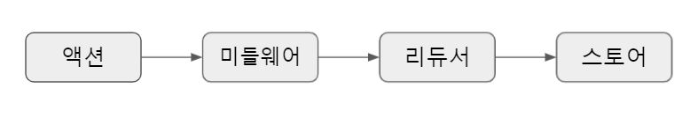
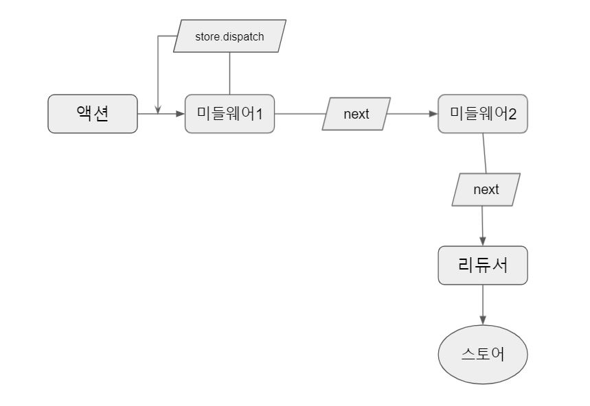
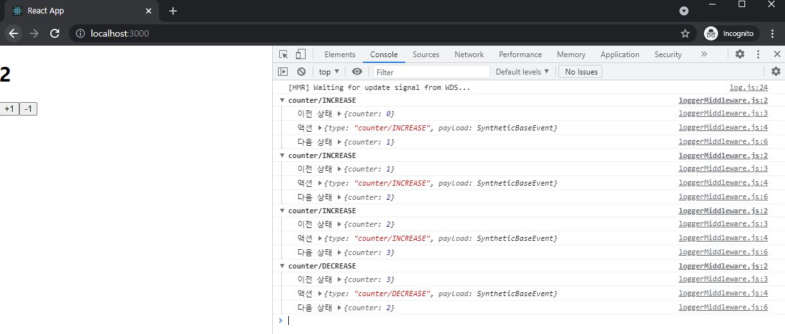
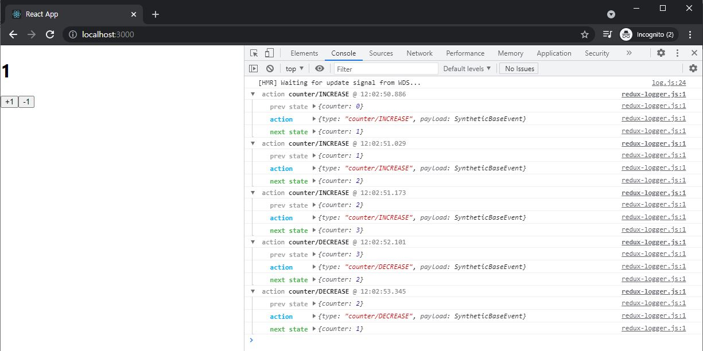
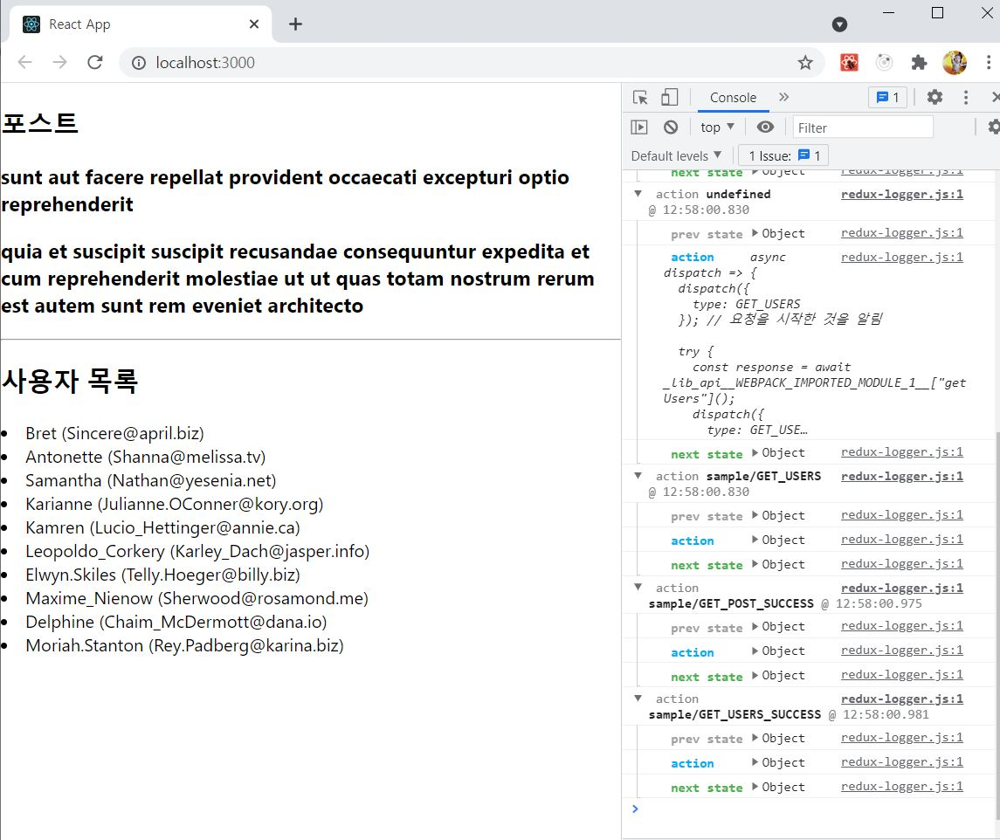

# ReactJS-18 리덕스 미들웨어를 통한 비동기 작업관리

- 리액트 웹 애플리케이션에서 API 서버를 연동할 때는 API 요청에 대한 상태도 잘 관리해야 한다.
- 요청이 시작되었을 때는 로딩 중임을, 요청이 성공하거나 실패했을 때는 로딩이 끝났음을 명시해야 한다.
- 요청이 성공하면 서버에서 받아 온 응답에 대한 상태를 관리하고, 요청이 실패하면 서버에서 반환한 에러에 대한 상태를 관리해야 한다.


## 🔥1. 작업 환경 준비

```bash
$ yarn create react-app learn-redux-middleware
$ yarn add redux react-redux redux-actions
```

### 1-1) 리덕스를 위한 코드

```react
// src/modules/counter.js
import { createAction, handleActions } from 'redux-actions';

const INCREASE = 'counter/INCREASE';
const DECREASE = 'counter/DECREASE';

export const increase = createAction(INCREASE);
export const decrease = createAction(DECREASE);

const initialState = 0; // 상태는 꼭 객체일 필요가 없다.

const counter = handleActions(
    {
        [INCREASE]: state => state + 1,
        [DECREASE]: state => state - 1,
    },
    initialState
);

export default counter;
```

```react
// src/modules/index.js
import { combineReducers } from 'redux';
import counter from './counter';

const rootReducer = combineReducers({
    counter
});

export default rootReducer;
```

```react
// src/index.js
import React from 'react';
import ReactDOM from 'react-dom';
import './index.css';
import App from './App';
import { createStore } from 'redux';
import { Provider } from 'react-redux';
import rootReducer from './modules';

const store = createStore(rootReducer);

ReactDOM.render(
  <Provider store={store}>
    <App />
  </Provider>,
  document.getElementById('root')
);
```


### 1-2) 프레젠테이셔널 컴포넌트와 컨테이너 컴포넌트 작성

```react
// src/components/Counter.js
import React from 'react';

const Counter = ({ onIncrease, onDecrease, number }) => {
    return (
        <div>
            <h1>{number}</h1>
            <button onClick={onIncrease}>+1</button>
            <button onClick={onDecrease}>-1</button>
        </div>
    );
};

export default Counter;
```

```react
// src/containers/CounterContainer.js
import React from 'react';
import { connect } from 'react-redux';
import { increase, decrease } from '../modules/counter';
import Counter from '../components/Counter';

const CounterContainer = ({ number, increase, decrease }) => {
    return (
        <Counter number={number} onIncrease={increase} onDecrease={decrease} />
    );
};

export default connect(
    state => ({
        number: state.counter
    }),
    {
        increase,
        decrease
    }
)(CounterContainer);
```

```react
// src/App.js
import React from 'react';
import CounterContainer from './containers/CounterContainer';

const App = () => {
  return (
    <div>
      <CounterContainer />
    </div>
  );
};

export default App;
```


## 🔥2. 미들웨어

- 리덕스 미들웨어는 액션을 디스패치했을 때 리듀서에서 이를 처리하기에 앞서 **사전에 지정된 작업들을 실행**한다.
- 미들웨어는 **액션과 리듀서 사이의 중간자**라고 볼 수 있다.



- 리듀서가 액션을 처리하기 전에 미들웨어가 할 수 있는 작업
  - 전달받은 액션을 단순히 콘솔에 기록
  - 전달받은 액션 정보를 기반으로 액션을 아예 취소하거나, 다른 종류의 액션을 추가로 디스패치할 수 있다.


### 2-1) 미들웨어 만들기

- 액션이 디스패치될 때마다 **액션의 정보**와 **액션이 디스패치되기 전후의 상태**를 콘솔에 보여주는 로깅 미들웨어를 작성해본다.

```react
// src/lib/loggerMiddleware.js
const loggerMiddleware = store => next => action => {
    // 미들웨어 기본 구조
};

export default loggerMiddleware;
```

- 화살표 함수를 연달아서 사용했는데, 일반 function 키워드로 풀어서 쓴다면 다음과 같다.

```react
const loggerMiddleware = function loggerMiddleware(store) {
    return function(next) {
        return function(action) {
            // 미들웨어 기본 구조
        };
    };
};
```

- 미들웨어는 함수를 반환하는 함수를 반환하는 함수이다.
- 함수에서 파라미터로 받아오는 값
  - `store`는 리덕스 스토어 인스턴스
  - `action`은 디스패치된 액션을 가리킨다.
  - `next` 파라미터는 함수 형태이며, `store.dispatch`와 비슷한 역할을 한다. 차이점은 `next(action)` 을 호출하면 **그 다음 처리해야 할 미들웨어에게 액션을 넘겨주고**, 만약 그다음 미들웨어가 없다면 **리듀서에게 액션을 넘겨준다.**
- 미들웨어 내부에서 `store.dispatch`를 사용하면 첫 번째 미들웨어부터 다시 처리한다.
- 만약 미들웨어에서 `next`를 사용하지 않으면 액션이 리듀서에 전달되지 않는다.



- 미들웨어 구현
  - 이전 상태, 액션 정보, 새로워진 상태를 콘솔에 보여준다.

```react
// src/lib/loggerMiddleware.js
const loggerMiddleware = store => next => action => {
    console.group(action && action.type);   // 액션 타입으로 log를 그룹화함
    console.log('이전 상태', store.getState());
    console.log('액션', action);
    next(action);   // 다음 미들웨어 혹은 리듀서에게 전달
    console.log('다음 상태', store.getState()); // 업데이트된 상태
    console.groupEnd(); // 그룹 끝
};

export default loggerMiddleware;
```

```react
// src/index.js
...
import { createStore, applyMiddleware } from 'redux';
...
import loggerMiddleware from './lib/loggerMiddleware';

const store = createStore(rootReducer, applyMiddleware(loggerMiddleware));

...
```




### 2-2) redux-logger 사용하기

```bash
$ yarn add redux-logger
```

```react
// src/index.js
...
// import loggerMiddleware from './lib/loggerMiddleware';
import { createLogger } from 'redux-logger';

const logger = createLogger();
const store = createStore(rootReducer, applyMiddleware(logger));
...
```




## 🔥3. 비동기 작업을 처리하는 미들웨어 사용

- 비동기 작업을 처리할 때 도움을 주는 미들웨어는 다양하다. 이번에 사용할 미들웨어는 다음과 같다.
  - redux-thunk: 객체가 아닌 함수 형태의 액션을 디스패치할 수 있게 해준다.
  - redux-saga: 특정 액션이 디스패치되었을 때 정해진 로직에 따라 다른 액션을 디스패치시키는 규칙을 작성하여 비동기 작업을 처리


### 3-1) redux-thunk

#### 3-1-1) Thunk

- Thunk는 **특정 작업을 나중에 할 수 있도록 미루기 위해 함수 형태로 감싼 것**을 의미


#### 3-1-2) 미들웨어 적용하기

```bash
$ yarn add redux-thunk
```

```react
// src/index.js
...
import ReduxThunk from 'redux-thunk';

...
const store = createStore(rootReducer, applyMiddleware(logger, ReduxThunk));
...
```


#### 3-1-3) Thunk 생성 함수 만들기

- redux-thunk는 액션 생성 함수에서 일반 액션 객체를 반환하는 대신에 **함수를 반환**한다.

```react
// src/modules/counter.js
...

// 1초 뒤에 increase 혹은 decrease 함수를 디스패치함
export const increaseAsync = () => dispatch => {
    setTimeout(() => {
        dispatch(increase());
    }, 1000);
};
export const decreaseAsync = () => dispatch => {
    setTimeout(() => {
        dispatch(decrease());
    }, 1000);
};

...
```

```react
// src/container/CounterContainer.js
...
import { increaseAsync, decreaseAsync } from '../modules/counter';
import Counter from '../components/Counter';

const CounterContainer = ({ number, increaseAsync, decreaseAsync }) => {
    return (
        <Counter number={number} onIncrease={increaseAsync} onDecrease={decreaseAsync} />
    );
};

export default connect(
    state => ({
        number: state.counter
    }),
    {
        increaseAsync,
        decreaseAsync
    }
)(CounterContainer);
```


- 처음 디스패치되는 액션은 함수 형태이고, 두 번째 액션은 객체 형태이다.


#### 3-1-4) 웹 요청 비동기 작업 처리하기

- JSONPlaceholder API 사용

```bash
$ yarn add axios
```

- 유지보수를 위해 API를 모두 함수화한다.

```react
// src/lib/api.js
import axios from 'axios';

export const getPost = id =>
    axios.get(`https://jsonplaceholder.typicode.com/posts/${id}`);

export const getUsers = id =>
    axios.get('https://jsonplaceholder.typicode.com/users');
```

- 리듀서 생성

```react
// src/modules/sample.js
import { handleActions } from 'redux-actions';
import * as api from '../lib/api';

// 액션 타입을 선언
// 한 요청당 세 개를 만든다.

const GET_POST = 'sample/GET_POST';
const GET_POST_SUCCESS = 'sample/GET_POST_SUCCESS';
const GET_POST_FAILURE = 'sample/GET_POST_FAILURE';

const GET_USERS = 'sample/GET_USERS';
const GET_USERS_SUCCESS = 'sample/GET_USERS_SUCCESS';
const GET_USERS_FAILURE = 'sample/GET_USERS_FAILURE';

// thunk 함수를 생성
// thunk 함수 내부에서는 시작할 때, 성공했을 때, 실패했을 때 다른 액션을 디스패치한다.

export const getPost = id => async dispatch => {
    dispatch({ type: GET_POST }); // 요청을 시작한 것을 알림
    try {
        const response = await api.getPost(id);
        dispatch({
            type: GET_POST_SUCCESS,
            payload: response.data
        }); // 요청 성공
    } catch (e) {
        dispatch({
            type: GET_POST_FAILURE,
            payload: e,
            error: true
        }); // 에러 발생
        throw e;    // 나중에 컴포넌트단에서 에러를 조회할 수 있게 해줌
    }
};

export const getUsers = () => async dispatch => {
    dispatch({ type: GET_USERS });  // 요청을 시작한 것을 알림
    try {
        const response = await api.getUsers();
        dispatch({
            type: GET_USERS_SUCCESS,
            payload: response.data
        }); // 요청 성공
    } catch (e) {
        dispatch({
            type: GET_USERS_FAILURE,
            payload: e,
            error: true
        }); // 에러 발생
        throw e;
    }
};

// 초기 상태를 선언
// 요청의 로딩 중 상태는 loading이라는 객체에서 관리
const initialState = {
    loading: {
        GET_POST: false,
        GET_USERS: false
    },
    post: null,
    users: null
}


const sample = handleActions(
    {
        [GET_POST]: state => ({
            ...state,
            loading: {
                ...state.loading,
                GET_POST: true // 요청 시작
            }
        }),
        [GET_POST_SUCCESS]: (state, action) => ({
            ...state,
            loading: {
                ...state.loading,
                GET_POST: false // 요청 완료
            },
            post: action.payload
        }),
        [GET_POST_FAILURE]: (state, action) => ({
            ...state,
            loading: {
                ...state.loading,
                GET_POST: false // 요청 완료
            }
        }),
        [GET_USERS]: state => ({
            ...state,
            loading: {
                ...state.loading,
                GET_USERS: true // 요청 시작
            }
        }),
        [GET_USERS_SUCCESS]: (state, action) => ({
            ...state,
            loading: {
                ...state.loading,
                GET_USERS: false // 요청 완료
            },
            users: action.payload
        }),
        [GET_USERS_FAILURE]: (state, action) => ({
            ...state,
            loading: {
                ...state.loading,
                GET_USERS: false // 요청 완료
            }
        }),
    },
    initialState
);

export default sample;
```

```react
// src/modules/index.js
import { combineReducers } from 'redux';
import counter from './counter';
import sample from './sample';

const rootReducer = combineReducers({
    counter,
    sample
});

export default rootReducer;
```

- Sample 컴포넌트(프레젠테이셔널 컴포넌트)

```react
// src/components/Sample.js
import React from 'react';

const Sample = ({ loadingPost, loadingUsers, post, users }) => {
    return (
        <div>
            <section>
                <h1>포스트</h1>
                {loadingPost && '로딩 중...'}
                {!loadingPost && post && (
                    <div>
                        <h3>{post.title}</h3>
                        <h3>{post.body}</h3>
                    </div>
                )}
            </section>
            <hr />
            <section>
                <h1>사용자 목록</h1>
                {loadingUsers && '로딩 중...'}
                {!loadingUsers && users && (
                    <div>
                        {users.map(user => (
                            <li key={user.id}>
                                {user.username} ({user.email})
                            </li>
                        ))}
                    </div>
                )}
            </section>
        </div>
    );
};

export default Sample;
```

- 컨테이너 컴포넌트

```react
// src/containers/SampleConatiner.js
import React from 'react';
import { connect } from 'react-redux';
import Sample from '../components/Sample';
import { getPost, getUsers } from '../modules/sample';

const { useEffect } = React;
const SampleContainer = ({
    getPost,
    getUsers,
    post,
    users,
    loadingPost,
    loadingUsers
}) => {
    // 클래스 형태 컴포넌트였다면 componentDidMount
    useEffect(() => {
        getPost(1);
        getUsers(1);
    }, [getPost, getUsers]);
    return (
        <Sample 
            post={post}
            users={users}
            loadingPost={loadingPost}
            loadingUser={loadingUsers}
        />
    );
};

export default connect(
    ({ sample }) => ({
        post: sample.post,
        users: sample.users,
        loadingPost: sample.loading.GET_POST,
        loadingUsers: sample.loading.GET_USERS
    }),
    {
        getPost,
        getUsers
    }
)(SampleContainer);
```

```react
// src/App.js
import React from 'react';
import SampleContainer from './containers/SampleContainer';

const App = () => {
  return (
    <div>
      <SampleContainer />
    </div>
  );
};

export default App;
```




#### 3-1-5) 리팩토링

(1) API 요청을 해주는 thunk 함수

```react
// src/lib/createRequestThunk.js
export default function createRequestThunk(type, request) {
    // 성공 및 실패 액션 타입을 정의한다.
    const SUCCESS = `${type}_SUCCESS`;
    const FAILURE = `${type}_FAILURE`;
    return params => async dispatch => {
        dispatch({ type }); // 시작됨
        try {
            const response = await request(params);
            dispatch({
                type: SUCCESS,
                payload: response.data
            }); // 성공
        } catch(e) {
            dispatch({
                type: FAILURE,
                payload: e,
                error: true
            }); // 에러 발생
            throw e;
        }
    };
}

// 사용법: createRequestThunk('GET_USERS', api.getUsers);
```

```react
// src/modules/sample.js
...
import createRequestThunk from '../lib/createRequestThunk';

...

// thunk 함수를 생성
// thunk 함수 내부에서는 시작할 때, 성공했을 때, 실패했을 때 다른 액션을 디스패치한다.

export const getPost = createRequestThunk(GET_POST, api.getPost);
export const getUsers = createRequestThunk(GET_USERS, api.getUsers);

...
```


(2) 요청의 로딩 상태를 관리하는 작업

```react
// src/modules/loading.js
import { createAction, handleActions } from 'redux-actions';

const START_LOADING = 'loading/START_LOADING';
const FINISH_LOADING = 'loading/FINISH_LOADING';

/*
    요청을 위한 액션 타입을 payload로 설정한다.(ex. "sample/GETPOST")
*/

export const startLoading = createAction(
    START_LOADING,
    requestType => requestType
);

export const finishLoading = createAction(
    FINISH_LOADING,
    requestType => requestType
);

const initialState = {};

const loading = handleActions(
    {
        [START_LOADING]: (state, action) => ({
            ...state,
            [action.payload]: true
        }),
        [FINISH_LOADING]: (state, action) => ({
            ...state,
            [action.payload]: false
        })
    },
    initialState
);

export default loading;
```

```react
// src/modules/index.js
...
import loading from './loading';

const rootReducer = combineReducers({
    counter,
    sample,
    loading
});

export default rootReducer;
```

- loading 리덕스 모듈에서 만든 액션 생성 함수는 앞에서 만든 createRequestThunk 에서 사용해준다.

```react
// src/lib/createRequestThunk.js
import { startLoading, finishLoading } from "../modules/loading";

export default function createRequestThunk(type, request) {
    ...
    return params => async dispatch => {
        dispatch({ type }); // 시작됨
        dispatch(startLoading(type));
        try {
            ...
            dispatch(finishLoading(type));
        } catch(e) {
            ...
            dispatch(startLoading(type));
            throw e;
        }
    };
}
```

```react
// src/containers/SampleContainer.js
...

export default connect(
    ({ sample, loading }) => ({
        ...
        loadingPost: loading['sample/GET_POST'],
        loadingUsers: loading['sample/GET_USERS']
    }),
    ...
)(SampleContainer);
```

- sample 리듀서에서 불필요한 코드를 지운다.

```react
// src/modules/sample.js
import { handleActions } from 'redux-actions';
import * as api from '../lib/api';
import createRequestThunk from '../lib/createRequestThunk';

// 액션 타입을 선언
// 한 요청당 세 개를 만든다.

const GET_POST = 'sample/GET_POST';
const GET_POST_SUCCESS = 'sample/GET_POST_SUCCESS';
const GET_USERS = 'sample/GET_USERS';
const GET_USERS_SUCCESS = 'sample/GET_USERS_SUCCESS';

// thunk 함수를 생성
// thunk 함수 내부에서는 시작할 때, 성공했을 때, 실패했을 때 다른 액션을 디스패치한다.

export const getPost = createRequestThunk(GET_POST, api.getPost);
export const getUsers = createRequestThunk(GET_USERS, api.getUsers);

// 초기 상태를 선언
// 요청의 로딩 중 상태는 loading이라는 객체에서 관리
const initialState = {
    post: null,
    users: null
}

const sample = handleActions(
    {
        [GET_POST_SUCCESS]: (state, action) => ({
            ...state,
            post: action.payload
        }),
        [GET_USERS_SUCCESS]: (state, action) => ({
            ...state,
            users: action.payload
        }),
    },
    initialState
);

export default sample;
```

