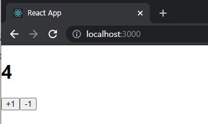

# ReactJS-18 리덕스 미들웨어를 통한 비동기 작업관리

- 리액트 웹 애플리케이션에서 API 서버를 연동할 때는 API 요청에 대한 상태도 잘 관리해야 한다.
- 요청이 시작되었을 때는 로딩 중임을, 요청이 성공하거나 실패했을 때는 로딩이 끝났음을 명시해야 한다.
- 요청이 성공하면 서버에서 받아 온 응답에 대한 상태를 관리하고, 요청이 실패하면 서버에서 반환한 에러에 대한 상태를 관리해야 한다.


## 🔥1. 작업 환경 준비

```bash
$ yarn create react-app learn-redux-middleware
$ yarn add redux react-redux redux-actions
```

### 1-1) 리덕스를 위한 코드

```react
// src/modules/counter.js
import { createAction, handleActions } from 'redux-actions';

const INCREASE = 'counter/INCREASE';
const DECREASE = 'counter/DECREASE';

export const increase = createAction(INCREASE);
export const decrease = createAction(DECREASE);

const initialState = 0; // 상태는 꼭 객체일 필요가 없다.

const counter = handleActions(
    {
        [INCREASE]: state => state + 1,
        [DECREASE]: state => state - 1,
    },
    initialState
);

export default counter;
```

```react
// src/modules/index.js
import { combineReducers } from 'redux';
import counter from './counter';

const rootReducer = combineReducers({
    counter
});

export default rootReducer;
```

```react
// src/index.js
import React from 'react';
import ReactDOM from 'react-dom';
import './index.css';
import App from './App';
import { createStore } from 'redux';
import { Provider } from 'react-redux';
import rootReducer from './modules';

const store = createStore(rootReducer);

ReactDOM.render(
  <Provider store={store}>
    <App />
  </Provider>,
  document.getElementById('root')
);
```


### 1-2) 프레젠테이셔널 컴포넌트와 컨테이너 컴포넌트 작성

```react
// src/components/Counter.js
import React from 'react';

const Counter = ({ onIncrease, onDecrease, number }) => {
    return (
        <div>
            <h1>{number}</h1>
            <button onClick={onIncrease}>+1</button>
            <button onClick={onDecrease}>-1</button>
        </div>
    );
};

export default Counter;
```

```react
// src/containers/CounterContainer.js
import React from 'react';
import { connect } from 'react-redux';
import { increase, decrease } from '../modules/counter';
import Counter from '../components/Counter';

const CounterContainer = ({ number, increase, decrease }) => {
    return (
        <Counter number={number} onIncrease={increase} onDecrease={decrease} />
    );
};

export default connect(
    state => ({
        number: state.counter
    }),
    {
        increase,
        decrease
    }
)(CounterContainer);
```

```react
// src/App.js
import React from 'react';
import CounterContainer from './containers/CounterContainer';

const App = () => {
  return (
    <div>
      <CounterContainer />
    </div>
  );
};

export default App;
```




## 🔥2. 미들웨어

- 리덕스 미들웨어는 액션을 디스패치했을 때 리듀서에서 이를 처리하기에 앞서 **사전에 지정된 작업들을 실행**한다.
- 미들웨어는 **액션과 리듀서 사이의 중간자**라고 볼 수 있다.


- 리듀서가 액션을 처리하기 전에 미들웨어가 할 수 있는 작업
  - 전달받은 액션을 단순히 콘솔에 기록
  - 전달받은 액션 정보를 기반으로 액션을 아예 취소하거나, 다른 종류의 액션을 추가로 디스패치할 수 있다.


### 2-1) 미들웨어 만들기

- 액션이 디스패치될 때마다 **액션의 정보**와 **액션이 디스패치되기 전후의 상태**를 콘솔에 보여주는 로깅 미들웨어를 작성해본다.

```react
// src/lib/loggerMiddleware.js
const loggerMiddleware = store => next => action => {
    // 미들웨어 기본 구조
};

export default loggerMiddleware;
```

- 화살표 함수를 연달아서 사용했는데, 일반 function 키워드로 풀어서 쓴다면 다음과 같다.

```react
const loggerMiddleware = function loggerMiddleware(store) {
    return function(next) {
        return function(action) {
            // 미들웨어 기본 구조
        };
    };
};
```

- 미들웨어는 함수를 반환하는 함수를 반환하는 함수이다.
- 함수에서 파라미터로 받아오는 값
  - `store`는 리덕스 스토어 인스턴스
  - `action`은 디스패치된 액션을 가리킨다.
  - `next` 파라미터는 함수 형태이며, `store.dispatch`와 비슷한 역할을 한다. 차이점은 `next(action)` 을 호출하면 **그 다음 처리해야 할 미들웨어에게 액션을 넘겨주고**, 만약 그다음 미들웨어가 없다면 **리듀서에게 액션을 넘겨준다.**
- 미들웨어 내부에서 `store.dispatch`를 사용하면 첫 번째 미들웨어부터 다시 처리한다.
- 만약 미들웨어에서 `next`를 사용하지 않으면 액션이 리듀서에 전달되지 않는다.


- 미들웨어 구현
  - 이전 상태, 액션 정보, 새로워진 상태를 콘솔에 보여준다.

```react
// src/lib/loggerMiddleware.js
const loggerMiddleware = store => next => action => {
    console.group(action && action.type);   // 액션 타입으로 log를 그룹화함
    console.log('이전 상태', store.getState());
    console.log('액션', action);
    next(action);   // 다음 미들웨어 혹은 리듀서에게 전달
    console.log('다음 상태', store.getState()); // 업데이트된 상태
    console.groupEnd(); // 그룹 끝
};

export default loggerMiddleware;
```

```react
// src/index.js
...
import { createStore, applyMiddleware } from 'redux';
...
import loggerMiddleware from './lib/loggerMiddleware';

const store = createStore(rootReducer, applyMiddleware(loggerMiddleware));

...
```


### 2-2) redux-logger 사용하기

```bash
$ yarn add redux-logger
```

```react
// src/index.js
...
// import loggerMiddleware from './lib/loggerMiddleware';
import { createLogger } from 'redux-logger';

const logger = createLogger();
const store = createStore(rootReducer, applyMiddleware(logger));
...
```


## 🔥3. 비동기 작업을 처리하는 미들웨어 사용

