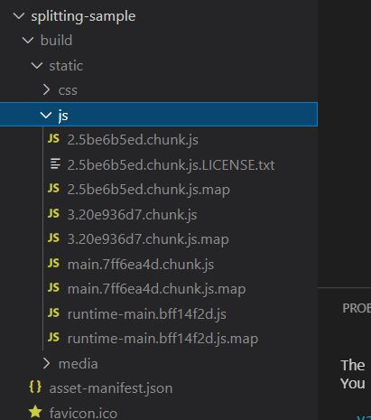
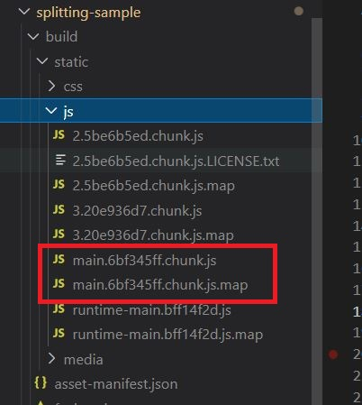
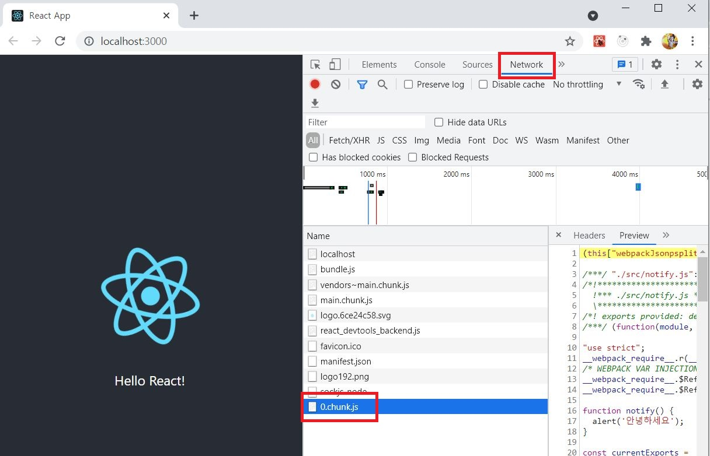
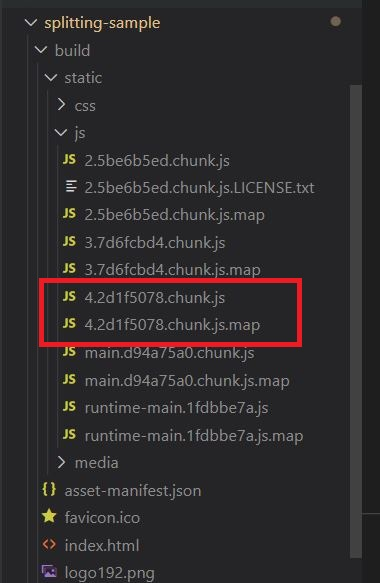
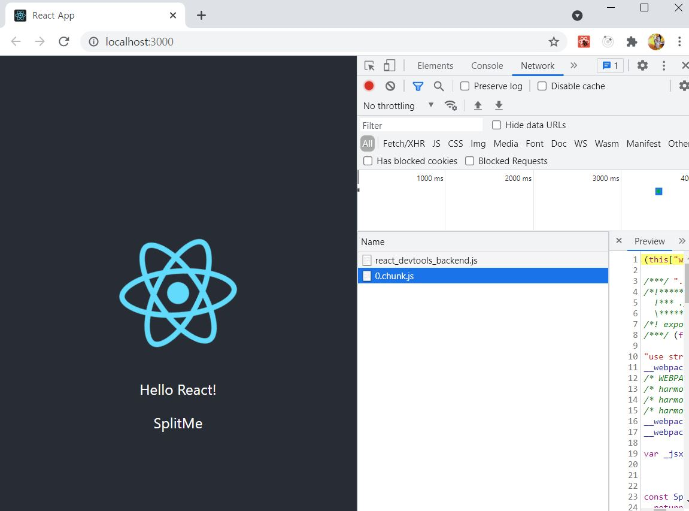
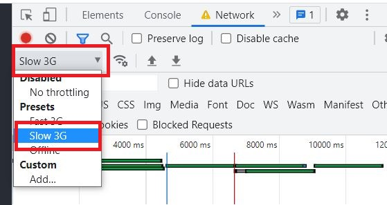
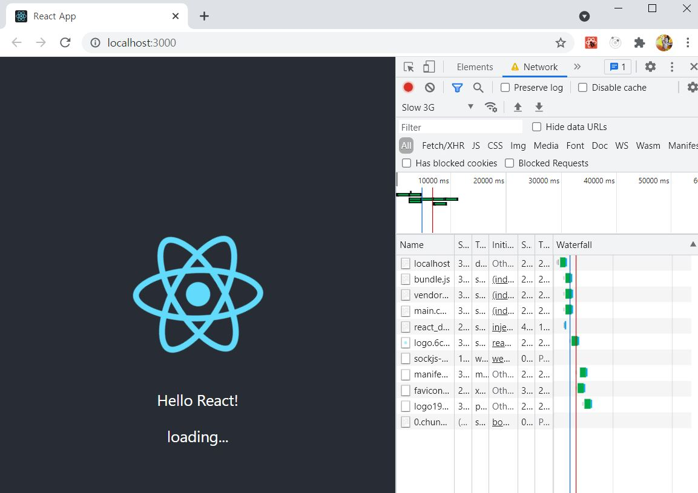

# ReactJS-19 코드 스플리팅

- 리액트 프로젝트를 완성하여 사용자에게 제공할 때는 **빌드 작업을 거쳐서 배포해야 한다.**
  - 프로젝트에서 사용되는 자바스크립트 파일 안에서 불필요한 주석, 경고 메시지, 공백 등을 제거하여 파일 크기를 최소화한다.
  - 브라우저에서 JSX 문법이나 다른 최신 자바스크립트 문법이 원할하게 실행되도록 코드의 트랜스파일 작업도 할 수 있다.
- 이러한 작업은 **웹팩**이라는 도구가 담당한다.
  - 웹팩에서 별도의 설정을 하지 않으면 프로젝트에서 사용 중인 모든 자바스크립트 파일이 하나의 파일로 합쳐지고, 모든 CSS 파일도 하나의 파일로 합쳐진다.
- CRA(create-react-app)로 프로젝트를 빌드할 경우 최소 두 개 이상의 자바스크립트 파일이 생성된다.
  - CRA의 기본 웹팩 설정에는 **SplitChunks** 라는 기능이 적용되어 node_modules 에서 불러온 파일, 일정 크기 이상의 파일, 여러 파일 간에 **공유된 파일을 자동으로 따로 분리시켜 캐싱의 효과를 얻는다.**

```bash
$ yarn create react-app splitting-sample
$ cd splitting-sample
$ yarn  build
```



- 파일 이름을 보면 '5be6b5ed' 같은 해시 값이 포함되어 있다. 이 값은 빌드하는 과정에서 해당 파일의 내용에 따라 생성되며, 이를 통해 브라우저가 새로 파일을 받아야 할지 받지 말아야 할지 알 수 있다.
  - 2로 시작하는 파일에는 React, ReactDOM 등 node_modules에서 불러온 라이브러리 관련 코드가 있다.
  - main으로 시작하는 파일에는 직접 프로젝트에 작성하는 App 같은 컴포넌트에 대한 코드가 들어 있다.
- SplitChunks 라는 웹팩 기능을 통해 자주 바뀌지 않는 코드들이 2로 시작하는 파일에 들어 있기 때문에 캐싱의 이점을 가진다.

```react
// src/App.js
...
	<p>Hello React!</p>
...
```

- App.js 의 코드를 변경하고 yarn build를 통해 프로젝트를 다시 빌드해본다.



- 2로 시작하는 파일의 이름은 바뀌지 않았고, 작성하는 컴포넌트 관련 코드가 들어 있던 main 으로 시작하는 파일의 이름은 바뀌었다.
- 이렇게 파일을 분리하는 작업을 코드 스플리팅이라고 한다.
  - 프로젝트에 기본 탑재된 SplitChunks 기능을 통한 코드 스플리팅은 단순히 효율적인 캐싱 효과만 있을 뿐이다.
  - 사용자가 A페이지에 방문 했다면 B페이지와 C페이지에서 사용하는 컴포넌트 정보는 필요하지 않다.
  - 사용자가 실제로 B 혹은 C 페이지로 이동하려고 할 때만 필요하다.
- 하지만 리액트 프로젝트에 별도로 설정하지 않으면 A, B, C 컴포넌트에 대한 코드가 모두 한 파일(main)에 저장된다. 만약 애플리케이션 규모가 커지면 필요하지 않은 컴포넌트 정보도 모두 불러오면서 로딩이 오래 걸린다.
- 이러한 문제점을 해결해 주는 방법이 코드 비동기 로딩이다.
  - 자바스크립트 함수, 객체, 컴포넌트를 처음에 불러오지 않고 필요한 시점에 불러와서 사용할 수 있다.


## 🔥1. 자바스크립트 함수 비동기 로딩

- 코드를 다음과 같이 작성하고 빌드하면 notify 코드가 main 파일 안에 들어가게 된다.

```react
// src/notify.js
export default function notify() {
    alert('안녕하세요!');
}
```

```react
// src/App.js
...
import notify from './notify';

function App() {
  const onClick = () => {
    notify();
  };
  return (
    <div className="App">
      <header className="App-header">
        
        <p onClick={onClick}>Hello React!</p>
      </header>
    </div>
  );
}

export default App;
```


- 하지만 import 를 상단에서 하지 않고 import() 함수 형태로 메서드 안에서 사용하면, 파일을 따로 분리시켜서 저장한다.

```react
// src/App.js
import logo from './logo.svg';
import './App.css';

function App() {
  const onClick = () => {
    import('./notify').then(result => result.default());
  };
  ...
}

export default App;
```



- Hello React! 를 클릭하는 시점에 새로운 자바스크립트 파일을 불러온다.



- yarn build를 통해 프로젝트 빌드를 하면 4로 시작하는 파일 안에 notify 관련 코드가 들어간다.


## 🔥2. React.lazy와 Suspense를 통한 컴포넌트 코드 스플리팅

### 2-1) state를 사용한 코드 스플리팅

```react
// 코드 스플리팅할 컴포넌트
// src/SplitMe.js
import React from 'react';

const SplitMe = () => {
    return <div>SplitMe</div>;
};

export default SplitMe;
```

```react
// src/App.js
import React, { Component } from 'react';
import logo from './logo.svg';
import './App.css';

class App extends Component {
  state = {
    SplitMe: null
  };
  handleClick = async () => {
    const loadedModule = await import('./SplitMe');
    this.setState({
      SplitMe: loadedModule.default
    });
  };
  render() {
    const { SplitMe } = this.state;
    return (
      <div className="App">
        <header className="App-header">
          
          <p onClick={this.handleClick}>Hello React!</p>
          {SplitMe && <SplitMe />}
        </header>
      </div>
    );
  }
}

export default App;
```




### 2-2) React.lazy와 Suspense 사용하기

- React.lazy와 Suspense를 사용하면 코드 스플리팅을 하기 위해 state를 따로 선언하지 않고 간편하게 컴포넌트 코드 스플리팅을 할 수 있다.

- React.lazy

  - 컴포넌트를 렌더링하는 시점에서 비동기적으로 로딩할 수 있게 해주는 유틸 함수이다.

  - ```react
    const SplitMe = React.lazy(() => import('./SplitMe'))
    ```

- Suspense

  - 리액트 내장 컴포넌트로서 코드 스플리팅된 컴포넌트를 로딩하도록 발동시킬 수 있고, 로딩이 끝나지 않았을 때 보여줄 UI를 설정할 수 있다.

  - ```react
    import React, { Suspense } from 'react';
    
    ...
    <Suspense fallback={<div>loading...</div>}>
    	<SplitMe />
    </Suspense>
    ```


```react
// src/App.js
import React, { useState, Suspense } from 'react';
import logo from './logo.svg';
import './App.css';

const SplitMe = React.lazy(() => import('./SplitMe'));
const App = () => {
  const [visible, setVisible] = useState(false);
  const onClick = () => {
    setVisible(true);
  };
  return (
    <div className="App">
      <header className="App-header">
        
          <p onClick={onClick}>Hello React!</p>
          <Suspense fallback={<div>loading...</div>}>
            {visible && <SplitMe />}
          </Suspense>
      </header>
    </div>
  );
};

export default App;
```



- 인터넷 속도를 느리게 해서 로딩 문구가 나타난지 살펴본다.




### 2-3) Loadable Components를 통한 코드 스플리팅

- `Loadable Components`는 코드 스플리팅을 편하게 하도록 도와주는 서드파티 라이브러리이다.

- 이 라이브러리의 이점은 **서버 사이드 렌더링**을 지원한다.

  - 서버 사이드 렌더링이란 <u>웹 서비스의 초기 로딩 속도 개선</u>, <u>캐싱 및 검색 엔진 최적화</u>를 가능하게 해주는 기술이다.
  - 웹 서비스의 초기 렌더링을 사용자의 브라우저가 아닌 서버 쪽에서 처리한다.
  - 사용자는 서버에서 렌더링한 html 결과물을 받아와서 그대로 사용하기 때문에 초기 로딩 속도가 개선된다.

- ```bash
  $ yarn add @loadable/component
  ```

- 사용법은 React.lazy와 비슷하다. Suspense를 사용할 필요가 없다.

```react
// src/App.js
...
import loadable from '@loadable/component';

const SplitMe = loadable(() => import('./SplitMe'));
const App = () => {
  ...
  return (
    <div className="App">
      <header className="App-header">
        
          <p onClick={onClick}>Hello React!</p>
          {visible && <SplitMe />}
      </header>
    </div>
  );
};

export default App;
```


- 로딩 중에 다른 UI를 보여주고 싶다면 loadable을 사용하는 부분을 다음과 같이 수정한다.

```react
const SplitMe = loadable(() => import('./SplitMe'), {
  fallback: <div>loading...</div>
});
```


- 컴포넌트를 미리 불러올 수 있다. (preload)
- 마우스 커서를 올리는 시점에 로딩이 시작되고, 클릭했을 때 렌더링 된다.

```react
// src/App.js
...

const App = () => {
  ...
  const onMouseOver = () => {
    SplitMe.preload();
  }
  return (
      ...
          <p onClick={onClick} onMouseOver={onMouseOver}>Hello React!</p>
          {visible && <SplitMe />}
      ...
  );
};

export default App;
```
