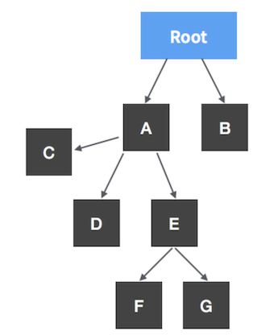
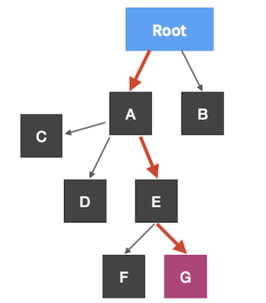
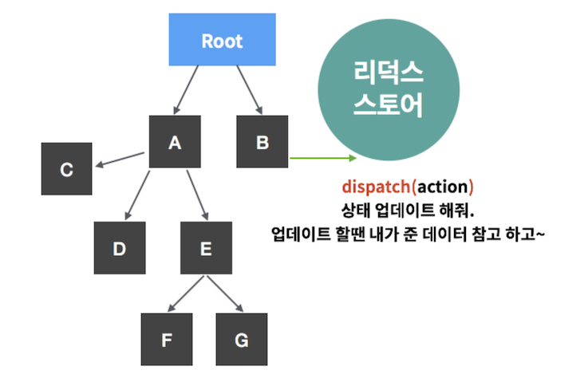
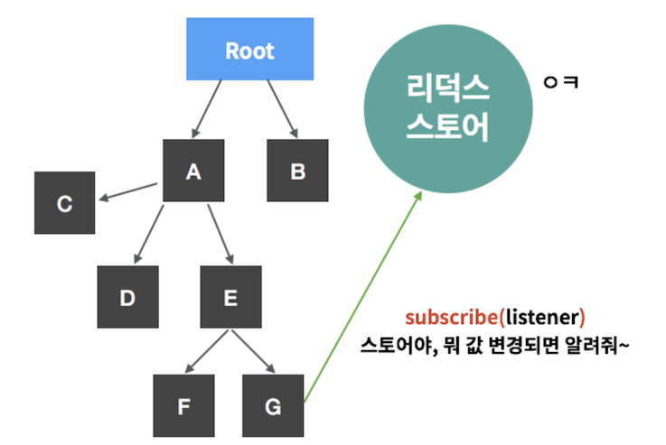
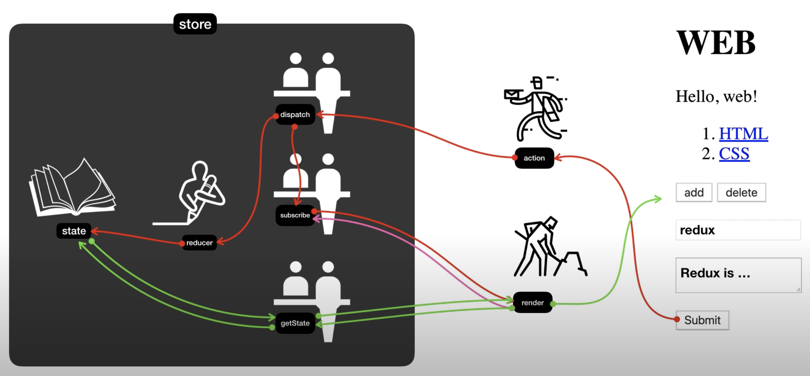

# 리덕스

> 자바스크립트 앱을 위한 예측 가능한 상태 컨테이너
>
> https://ko.redux.js.org/

- 애플리케이션의 복잡성을 낮추기 위해서 탄생하였다.


### 💡왜 리덕스를 쓸까

- 리액트 애플리케이션은 컴포넌트 간에 데이터를 props로 전달하기 때문에 컴포넌트 여기저기서 필요한 데이터가 있을 때 주로 최상위 컴포넌트인 App.js 에서 상태를 관리한다.
- 이러한 구조는 부모 컴포넌트에서 모든걸 관리하고 아래로 내려주기 때문에, 직관적이고 관리하기도 쉬워보인다.
- 하지만 애플리케이션의 규모가 커지면 컴포넌트의 개수가 늘어나고, 다루는 데이터와 그 데이터를 업데이트 하는 함수들도 늘어남에 따라 상당히 복잡해진다.
- 
- 위와 같은 컴포넌트 구조에서 Root에서 G컴포넌트에게 데이터를 전달해줘야 한다면 A,E 를 거쳐야 한다.



- ```react
  // App.js 에서 A 렌더링
  <A value={5} />
  
  // A.js 에서 E 렌더링
  <E value={this.props.value} />
  
  // E.js 에서 G 렌더링
  <G value={this.props.value} />
  ```

---

- 리덕스를 쓰면 상태관리를 컴포넌트 바깥에서 한다!
- 예를 들어 B 컴포넌트에서 일어나는 변화가 G 컴포넌트에 반영된다고 가정한다.
- 
- 


### 💡리덕스의 특징

1. 단 하나의 진실의 원천(Single Source of Truth)

   - 하나의 상태(=객체)를 갖는다!!
   - 하나의 객체 안에 애플리케이션에 필요한 모든 데이터를 넣는다.
   - 데이터를 중앙 집중적으로 관리하면 여러곳에 데이터가 흩어져 있는 것보다 데이터를 관리하기가 쉽다.
   - 이런 것들을 통해 애플리케이션의 복잡성을 낮춘다.

2. 데이터를 외부로부터 철저하게 차단시킨다.

   - 그러면 어떻게 데이터를 읽고 수정하는가!?

   - 지정된 담당자(=함수)만이 할 수 있다.
   - dispatch, reducer, getState
   - 예를 들어 데이터를 삽입이나 수정하고 싶다면 dispatch, reducer 를 통해 가능하다.
   - 예를 들어 데이터를 읽고 싶다면 getState 를 통해 가능하다.
   - 이렇게 때문에 데이터를 외부에서 직접적으로 제어할 수 없도록 한다. 이를 통해 예기치 않게 state 값이 바뀌는 문제를 사전에 차단한다. => 우리 애플리케이션을 보다 예측 가능하게 만든다.


### 💡리덕스의 전체적인 동작 과정



- store(은행이라고 비유 => 정보가 저장되는 곳)
  - 실제 정보는 state라는 곳에 저장된다.
  - state에 직접 접근하는 것은 금지되어있고, 불가능하다. 항상 누군가를 통해서 데이터에 접근해야 한다.
  - 은행의 돈을 직접 만질 수 없는 것고 은행 창구를 통해 접근 하는 것처럼 state에 접근하기 위한 특정 메서드들이 있다. => dispatch, subscribe, getState
  - 한개의 프로젝트는 단 하나의 스토어만 가질 수 있다.
  - 스토어 안에는 현재 애플리케이션 상태와 리듀서가 들어가 있고, 다른 내장 함수들(dispatch, subscribe, ..)이 있다.
- reducer
  - 변화를 일으키는 함수
  - 액션을 발생시키면 리듀서가 현재 상태와 전달받은 액션 객체를 파라미터로 받아온다.
  - 그리고 두 값을 참고하여 새로운 상태를 만들어서 반환해준다.
- render 라는 함수는 store 바깥에 있다. 리덕스와 상관 없이 우리가 만든 코드이다. UI를 만들어 줄 우리가 만들 코드이다.


1. 초록색 화살표

   - `render()`

   - ```javascript
     function render() {
       var state = store.getState();
       (...)
     }
     ```

   - render() 함수는 store의 getState() 를 호출하면서 state의 값을 가져오고 이것을 UI에 반영한다.

2. 분홍색 화살표

   - `subscribe()`

   - ```javascript
     store.subscribe(render);
     ```

   - store의 state 값이 바뀔 때마다 render 함수를 호출할 수 있다면 따로 데이터는 신경쓰지 않고 UI만 신경쓸 수 있다.
   - 알아서 state값이 바뀔 때마다 UI가 갱신된다.

3. 빨간색 화살표

   - ```react
     <form onsubmit="
       // ...
       store.dispatch({ type: 'create', payload: {title:title, desc:desc} })">
       (...)
     </form>
     ```

   - `dispatch`는 2가지 일을 한다.

     1. reducer를 호출해서 state 값을 바꾼다.

        - 그 작업이 끝나면 susbscribe를 이용해서 render 함수를 호출해준다. 그러면 화면이 갱신된다.

        - dispatch가 reducer를 호출할 때 2개의 값을 전달한다.

        - 현재의 state 값, 액션 객체를 전달한다.

        - ```react
          function reducer(state, action) {
          	if(action.type === 'create') {
              (...)
            }
          }
          ```

        - reducer는 state를 입력값으로 받고, action을 참조해서 새로운 state 값을 만들어내서 리턴해주는 역할을 한다.

        - state 값을 가공하는 가공자

     2. dispatch가 subscribe에 등록되어 있는 구독자들을 다 호출해준다.

        - 그러면 render가 호출되고 초록색 화살표의 로직을 수행한다.


---

- 참조
  - [생활코딩-리덕스](https://www.youtube.com/watch?v=Jr9i3Lgb5Qc&list=PLuHgQVnccGMB-iGMgONoRPArZfjRuRNVc)
  - https://velopert.com/3528
  - 도서: 리액트를 다루는 기술

