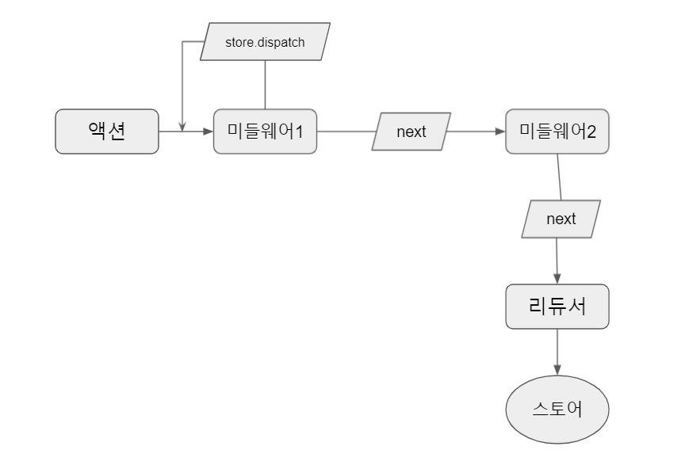

# Redux Middleware

- 미들웨어: OS와 소프트웨어 중간에서 조정과 중개 역할을 하는 중간 소프트웨어 역할([위키백과](https://ko.wikipedia.org/wiki/%EB%AF%B8%EB%93%A4%EC%9B%A8%EC%96%B4))
- 리덕스 미들웨어는 액션을 디스패치했을 때 리듀서에서 이를 처리하기에 앞서 사전에 지정된 작업들을 실행한다.
- 어떠한 두가지 요소의 중간에서 동작하는 소프트웨어라고 생각해보면 크게 보았을 때 그 의미가 대략 같다.
- 리덕스가 가지는 핵심 기능 중 하나는 **미들웨어를 사용할 수 있다는 점**이다.
- Context API나 MobX 경우에는 미들웨어를 지원하지 않는다.


## 💡1. 왜 미들웨어를 사용할까

- 리덕스의 리듀서 함수에는 지켜야 할 몇가지 [규칙](https://redux.js.org/tutorials/fundamentals/part-3-state-actions-reducers#rules-of-reducers)이 있다. 이 규칙에 의해 리듀서는 side effect를 발생시키면 안된다.
- side effect는 간략하게 함수 외부에 존재하는 state 혹은 behavior 에 의해 변화가 생기는 것이다.
  - 로깅, 파일 저장, 비동기 처리..
- 따라서 리듀서에는 비동기 로직이 존재하지 않는다. 하지만 우리는 로깅, 네트워크 처리 등이 필요하다.
- 이러한 문제점들은 미들웨어를 사용해여 해결된다.
  - 전달 받은 액션을 단순히 콘솔에 기록
  - 전달받은 액션 정보를 기반으로 액션을 아예 취소
  - 다른 종류의 액션을 추가로 디스패치
  - ...등등


## 💡2. 미들웨어 기본구조

- 미들웨어 기본구조

  - ```react
    const loggerMiddleware = store => next => action => {
    	// 	미들웨어 기본구조
    };
    
    export default loggerMiddleware;
    ```

  - ```react
    const loggerMiddleware = function loggerMiddleware(store) {
        return function(next) {
            return function(action) {
    					// 	미들웨어 기본구조
            }
        }
    }
    ```

  - 미들웨어는 함수를 반환하는 함수를 반환하는 함수이다.

  - `store` 는 리덕스 스토어 인스턴스: dispatch, getState()

  - `action` 은 디스패치된 액션

  - `next` 는 함수형태로 `store.dispatch` 와 비슷한 역할

    - `next(action)`을 호출하면 그 다음 처리해야 할 미들웨어에게 액션을 넘겨주고, 만약 그 다음 미들웨어가 없다면 리듀서에게 액션을 넘겨준다.
    - 미들웨어 내부에서 `store.dispatch` 를 사용하면 첫 번째 미들웨어부터 다시 처리한다.
    - 만약 미들웨어에서 `next`를 사용하지 않으면 액션이 리듀서에 전달되지 않는다. 액션이 무시된다.



```react
const loggerMiddleware = store => next => action => {
    console.group(action && action.type);
    console.log('이전 상태', store.getState());
    console.log('액션', action);
    next(action);
    console.log('다음 상태', store.getState());
    console.groupEnd();
};

export default loggerMiddleware;
```


## 💡3. reudx-thunk

- 비동기 작업을 처리할 때 가장 기본적으로 사용하는 미들웨어
- [문서](https://github.com/reduxjs/redux-thunk)


### 3-1) Thunk

- Thunk는 특정 작업을 나중에 할 수 있도록 미루기 위해 **함수** 형태로 감싼 것을 의미한다.

  - ```react
    const addOne = x => x + 1;
    addOne(1);	// 2
    ```

- 위 코드를 실행하면 addOne을 호출했을 때 바로 1 + 1 이 연산이 된다.

- 이 연산 작업을 나중에 하도록 미루고 싶다면 어떻게 해야 할까?

  - ```react
    const addOne = x => x + 1;
    function addOneThunk (x) {
      // api 요청
      const thunk = () => addOne(x);
      return thunk;
    }
    
    const fn = addOneThunk(1);
    setTimeout(() => {
      const value = fn();
      console.log(value);
    }, 1000)
    ```

- 이렇게 하면 특정 작업을 나중에 하도록 미룰 수 있다.

- 화살표 함수로 다시 표현하면 다음과 같이 된다.

  - ```react
    const addOne = x => x + 1
    const addOneThunk = x => () => addOne(x);
    
    const fn = addOneThunk(1);
    setTimeout(() => {
      const value = fn();
      console.log(value);
    }, 1000);
    ```

- redux-thunk 라이브러리를 사용하는 예시 thunk 함수를 나타내면 다음과 같다.

  - ```react
    const sampleThunk = () => (dispatch, getState) => {
      // 현재 상태를 참조 가능하고,
      // 새 액션을 디스패치할 수 있다.
    }
    ```


### 3-2) redux-thunk

- redux-thunk 는 객체 대신 함수를 생성하는 액션 생성 함수를 작성할 수 있게 해준다.

- 리덕스에서는 기본적으로 액션 객체를 디스패치한다. 일반 액션 생성자는 다음과 같이 파라미터를 가지고 액션 객체를 생성하는 작업만 한다.

  - ```react
    const actionCreator = (payload) => ({action: 'ACTION', payload});
    ```

- 특정 액션이 몇 초뒤에 실행되게 하거나, 현재 상태에 따라 액션이 무시되게 하려면 일반 액션 생성자로서는 할 수가 없다.

- redux-thunk는 액션 생성자를 함수로 감싸줌으로 해결한다.

- 즉, 액션 생성 함수에서 일반 액션 객체를 반환하는 대신에 **함수를 반환**한다.

- ```react
  import { createAction, handleActions } from "redux-actions";
  
  // 액션 타입 정의
  const INCREASE = 'counter/INCREASE';
  const DECREASE = 'counter/DECREASE';
  
  // 액션 생성 함수
  export const increase = () => ({ type: INCREASE });
  export const decrease = () => ({ type: DECREASE });
  
  // Thunk 생성 함수
  // 1초 뒤에 increase 혹은 decrease 함수를 디스패치한다.
  export const increaseAsync = () => dispatch => {
      setTimeout(() => {
          dispatch(increase());
      }, 1000);
  };
  
  export const decreaseAsync = () => dispatch => {
      setTimeout(() => {
          dispatch(decrease());
      }, 1000);
  }
  
  
  // 초기값
  const initialState = 0;
  
  const counter = handleActions(
      {
          [INCREASE]: state => state + 1,
          [DECREASE]: state => state - 1,
      },
      initialState
  );
  
  export default counter;
  
  ```


- 처음 디스패치되는 액션은 함수 형태이고, 두 번째 액션은 객체 형태이다.


## 💡4. redux-thunk 사용시 data loading 순서

- 컴포넌트 마운트에서(라이프사이클) 액션 생성자를 호출한다.
  1. 컴포넌트가 화면에 렌더링 됨
  2. 컴포넌트에서 'ComoponentDidMount()' 라이프사이클 메서드를 호출
  3. 'ComponentDidMount()' 에서 action creator를 호출함
- API 요청은 Action Creator에서 담당하며, Redux-thunk가 여기서 작동한다.
  4. Action creator가 코드를 실행하며 API 요청
  5. API가 데이터를 응답
  6. Action creator는 'payload'에 가져온 데이터를 할당하고 action을 반환한다.
- redux store에서 새로운 state가 생성된다.(dispatch 된 action의 payload(데이터))
  7. reducer는 action을 보고 'payload'에 할당된 데이터를 가져온다.
  8. 새로운 state가 생성되었기 때문에 react 앱은 리렌더링 된다.


## 💡5. 정리

- 비동기 로직을 처리하기 위해서 리덕스 미들웨어를 사용한다.
- redux-thunk는 액션을 함수로 생성하고 추가적으로 필요한 작업들을 그 안에서 할 수 있게 만든다.


---

- 참조
  - 리액트를 다루는 기술
  -  https://velopert.com/3401
  - https://velog.io/@mokyoungg/Redux-Redux-thunk

